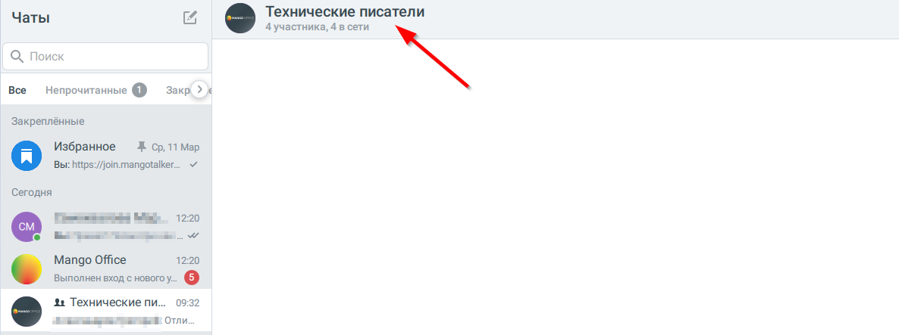
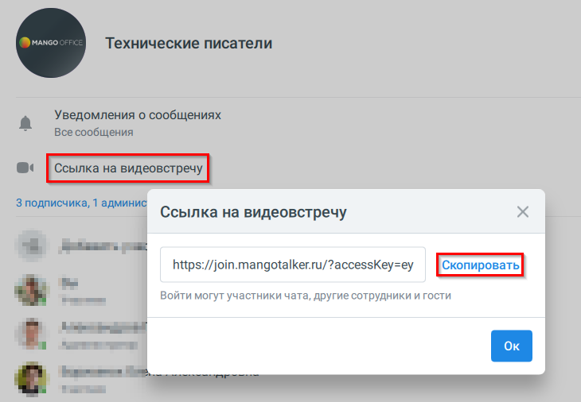

# 8.4. Работа с видеоконференцией (ВКС)

> Трассировка: PDF §8.4 · сквозные стр. 89-96 · источники: ч.1 `kb/sources/mtalker/UserGuide_Windows_mTalker_ch1_Working.11.06.26.pdf` с.89-96.

Общее Вы можете создать новую видео конференцию и пригласить в нее участников, предоставь им ссылку для присоединения. И наоборот, вы можете присоединиться по ссылке к видеоконференции, созданной другим сотрудником. При использовании видеоконференций пользователю могут отображаться подсказки и уведомления, описанные в разделе «Видеоконференции». Как создать новую видеоконференцию и предоставить ссылку для присоединения

Для этого, в основном окне MTalker в разделе “Конференции” следует:

1. нажмите на пункт “Создать ссылку на новую видеоконференцию” . Будет открыто окно “Ссылка на видеоконференцию”; 2. нажмите кнопку “Копировать”. Будет скопирована ссылка для присоединения к видеоконференции; 3. передайте ссылку на видеоконференцию всем, кто должен принимать участие в видеоконференции. Не более 8 человек; 4. нажмите кнопку “Открыть” в окне “Ссылка на видеоконференцию”. Будет выполнено одно из действий: – если включена настройка “Открывать видеозвонки во внешнем браузере” в разделе “Видео” вашего MTalker, то будет открыта новая страница браузера, на которой вам будет предложено авторизоваться в MTalker или войти как гость в видеоконференцию. Выполните одно из действий: • если вы хотите войти в видеоконференцию как сотрудник, то: 1. нажмите кнопку “Авторизоваться”; 2. войдите в ваш аккаунт MTalker при помощи логина и пароля или с помощью короткого кода; 3. в поле “Включите камеру” перед тем, как присоединиться к

видеоконференции, вы можете: включить микрофон;

включить камеру; установить настройки вашего участия в видеоконференции (например, размытие вашего фона); 4. затем в окне “Присоединиться” нажмите кнопку “Присоединиться”. После этого, вы присоединитесь к видеозвонку; • если вы хотите войти в видеоконференцию как гость (без авторизации), то: 1. нажмите кнопку “Войти как гость”; 2. укажите ваше имя в поле “Ваше имя”; Mango Talker для сред ОС Windows и Mac. Руководство пользователя | Версия от 11.06.2026 3. в поле “Включите камеру” перед тем, как присоединиться к

видеоконференции, вы можете: включить микрофон;

включить камеру; установить настройки вашего участия в видеоконференции (например, размытие вашего фона); 4. затем в окне “Присоединиться” нажмите кнопку “Присоединиться”. После этого, вы присоединитесь к видеозвонку;

– Если выключена настройка “Открывать видеозвонки во внешнем браузере” в разделе “Видео” вашего MTalker, то: 1. в окне MTalker будет открыто окно “Присоединиться”, в котором, перед

тем, как присоединиться к видеоконференции, вы можете: включить

микрофон; включить камеру; установить настройки вашего участия в видеоконференции (например, размытие вашего фона). 2. Затем в окне “Присоединиться” нажмите кнопку “Присоединиться”. После этого, вы присоединитесь к видеозвонку.

Как присоединиться по ссылке к ВКС Если вы получили ссылку на видеоконференцию и хотите присоединиться к видеоконференции,

в основном окне MTalker, в разделе “Конференции” выполните: Mango Talker для сред ОС Windows и Mac. Руководство пользователя | Версия от 11.06.2026

1. нажмите на кнопку “Присоединиться по ссылке” . Будет открыто окно “Вход в видеоконференцию”; 2. введите скопированную ссылку в поле “Ссылка”; 3. нажмите кнопку “Открыть”. Будет выполнено одно из действий: – если включена настройка “Открывать видеозвонки во внешнем браузере” в разделе “Видео” вашего MTalker, то будет открыта новая страница браузера, на которой вам будет предложено авторизоваться в MTalker или войти как гость в видеоконференцию. Выполните одно из действий: • если вы хотите войти в видеоконференцию как сотрудник, то: 1. нажмите кнопку “Авторизоваться”; 2. войдите в ваш аккаунт MTalker при помощи логина и пароля или с помощью короткого кода; 3. в поле “Включите камеру” перед тем, как присоединиться к

видеоконференции, вы можете: включить микрофон;

включить камеру; установить настройки вашего участия в видеоконференции (например, размытие вашего фона); 4. затем в окне “Присоединиться” нажмите кнопку “Присоединиться”. После этого, вы присоединитесь к видеозвонку; • если вы хотите войти в видеоконференцию как гость (без авторизации), то: 1. нажмите кнопку “Войти как гость”; 2. укажите ваше имя в поле “Ваше имя”; 3. в поле “Включите камеру” перед тем, как присоединиться к

видеоконференции, вы можете: включить микрофон;

включить камеру; установить настройки вашего участия в видеоконференции (например, размытие вашего фона); 4. затем в окне “Присоединиться” нажмите кнопку “Присоединиться”. После этого, вы присоединитесь к видеозвонку;

Mango Talker для сред ОС Windows и Mac. Руководство пользователя | Версия от 11.06.2026 – Если выключена настройка “Открывать видеозвонки во внешнем браузере” в разделе “Видео” вашего MTalker, то: 1. в окне MTalker будет открыто окно “Присоединиться”, в котором, перед

тем, как присоединиться к видеоконференции, вы можете: включить

<!-- изображение на стр. 92: байты не извлечены (PyMuPDF недоступен) -->

микрофон, включить камеру, установить настройки вашего участия в видеоконференции (например, размытие вашего фона); Mango Talker для сред ОС Windows и Mac. Руководство пользователя | Версия от 11.06.2026 2. затем в окне “Присоединиться” нажмите кнопку “Присоединиться”. После этого, вы присоединитесь к видеозвонку.

<!-- изображение на стр. 93: байты не извлечены (PyMuPDF недоступен) -->

Как предоставить доступ к видеоконференции по ссылке Видеоконференция будет доступна только тем абонентом, у которых есть ссылка.

<!-- изображение на стр. 93: байты не извлечены (PyMuPDF недоступен) -->

Выполните следующие действия в основном окне MTalker в разделе “Конференции” :

<!-- изображение на стр. 93: байты не извлечены (PyMuPDF недоступен) -->

1) нажмите на пункт “Создать ссылку на новую видеоконференцию” . Будет открыто окно “Ссылка на видеоконференцию”, в котором будет выдана ссылка на видеоконференцию; 2) нажмите на кнопку “Копировать”. Будет скопирована ссылка на видеоконференцию; 3) передайте ссылку на видеоконференцию всем участникам, которые будут принимать участие. Передать ссылку вы можете через чат в MTalker; 4) нажмите на кнопку “Открыть” в окне “Ссылка на видеоконференцию”. Будет запущена видеоконференция. Пользователи, получившие ссылку на конференцию, смогут по ней перейти к конференции. Mango Talker для сред ОС Windows и Mac. Руководство пользователя | Версия от 11.06.2026 Постоянная ссылка на видеоконференцию Создавайте видеоконференции и приглашайте коллег по ссылке. Если встреча уже создана другим сотрудником — просто перейдите по ссылке, чтобы присоединиться. Чтобы скопировать ссылку на видеоконференцию: 1. Откройте нужный чат и нажмите на карточку чата.

<!-- изображение на стр. 94: байты не извлечены (PyMuPDF недоступен) -->

2. В карточке чата нажмите кнопку «Ссылка на “видеовстречу”. В открывшемся окне — кнопку “Скопировать”.

<!-- изображение на стр. 94: байты не извлечены (PyMuPDF недоступен) -->

Скопированную ссылку можно отправить участникам или использовать при создании события в календаре. При запуске видеоконференции из этого чата будет использоваться та же ссылка. Mango Talker для сред ОС Windows и Mac. Руководство пользователя | Версия от 11.06.2026 Особенности  Для каждого группового чата используется одна постоянная ссылка на видеоконференцию.  Ссылка на видеоконференцию доступна всем участникам чата.  Изменить или удалить ссылку может только администратор чата.  При изменении или удалении ссылки информация об этом отображается в истории чата.  При удалении ссылки подключение к видеоконференции по ней становится недоступным.  При активной видеоконференции в чате отображается статус встречи и кнопка «Присоединиться».  Активная видеоконференция отображается в истории вызовов.  Функция применяется для групповых чатов, открытых и закрытых каналов. Mango Talker для сред ОС Windows и Mac. Руководство пользователя | Версия от 11.06.2026
