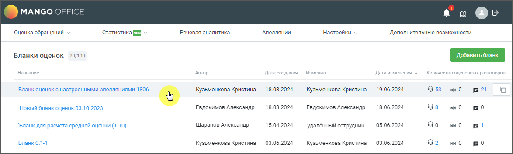
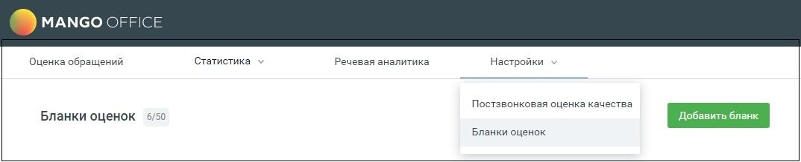
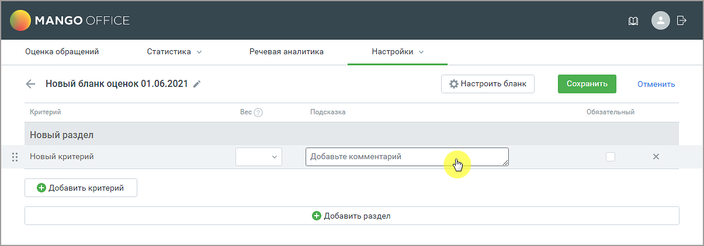

# 2.1. Создание бланка оценки

> Трассировка: PDF §2.1 · сквозные стр. 9-11 · источники: ч.1 `kb/sources/quality-managment/QM_manual_v-1.26.18.pdf` с.9-11.

Бланк может быть создан двумя способами:

1) Копирование – копирование уже существующего бланка с последующим редактированием копии. Выберите на рабочей области вкладки либо откройте бланк, который хотите скопировать.

Кликните на пиктограмму .

2) С нуля – пользователь заполняет вручную изначально пустой бланк. Для добавления нового бланка оценки зайдите в раздел Настройки/Бланки оценок и нажмите кнопку Добавить бланк.

Создается бланк с именем "Новый бланк оценок дд.мм.гггг".

Для изменения наименований полей кликните на поле левой кнопкой мыши. Далее измените название или добавьте текст подсказки. Бланк оценки включает: • Имя бланка – содержит не более 100 символов и не может быть пустым. Имена бланков не могут повторяться. • Критерии – вопрос, на который контролер должен проставить оценку. Один бланк включает не более 100 критериев. Имя критерия содержит не более 200 символов и не может быть пустым. • Разделы – группа критериев. Один бланк включает не более 50-ти разделов. Имя раздела содержит не более 100 символов и не может быть пустым. • Вес – вес критерия влияет на расчет оценки по критерию. Поле не является обязательным для заполнения. Если для критерия установлен вес, для получения итоговой оценки текущая оценка контролера по критерию умножается на вес. Допустимый вес критерия от 0,001 до 50. • Подсказки к критерию – текстовый комментарий к вопросу, не более 500 символов. • Чекбокс обязательности/не обязательности критерия – проставляется, если критерий является обязательным для оценки. • Тематики Речевой аналитики – выбор тематик РА для автоматической оценки по бланку.

| Важно: Настройка доступна при условии подключенной услуги Речевая аналитика и включенного |
| --- |
| в ЛК ВАТС переключателя «Настраивать бланк оценки для РА». |
| Путь к переключателю в ЛК ВАТС → «Безопасность и ограничения» → «Настройка доступа». Далее |
| для конкретной роли сотрудника необходимо последовательно выбрать «Инструменты» → |
| «Контроль качества». |

➢ максимальное количество выбираемых тематик для одного вопроса – 5; ➢ если на один вопрос назначено несколько тематик, то их суммарная оценка не может превышать максимальную оценку по шкале бланка; ➢ при отключении услуги «Речевая аналитика» в уже оцененных бланках оценка остается, правила оценки в бланках становятся недоступны для изменения; ➢ при изменении шкалы в бланке оценок оценки тематик обнуляются.

• Кнопка удаления критерия. • Кнопка Добавить критерий • Кнопка Добавить раздел • Кнопка СОХРАНИТЬ – сохраняет внесенные в бланк изменения • Кнопка ОТМЕНИТЬ – отменяет внесенные изменения, и возвращает пользователя к списку бланков на рабочей области вкладки.
