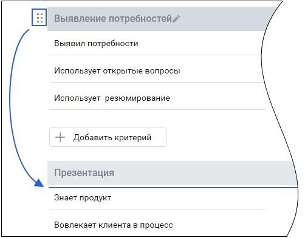

# 2.2. Просмотр и редактирование бланка оценки

> Трассировка: PDF §2.2 · сквозные стр. 11-12 · источники: ч.1 `kb/sources/quality-managment/QM_manual_v-1.26.18.pdf` с.11-12.

Просмотр бланка доступен из рабочей области вкладки. Для просмотра бланка щелкните по его наименованию. Если в созданном ранее бланке не были выставлены (сохранены) оценки ни по одному разговору, то критерии и разделы бланка можно добавлять, удалять или переименовывать.

Для перемещения раздела на другую позицию установите курсор на пиктограмме , и, удерживая левую кнопку мыши в нажатом состоянии, переместите раздел выше или ниже по списку. При изменении позиции раздела все критерии и подсказки внутри раздела перемещаются вместе с ним.

Аналогично перемещаются критерии. Позиция критерия может быть изменена как внутри одного раздела, так и между разделами. Вместе с критерием меняют позицию вес и подсказка к критерию.
