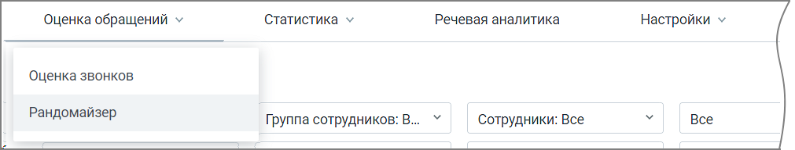

# 3. Оценка обращений

> Трассировка: PDF §3 · сквозные стр. 17 · источники: ч.1 `kb/sources/quality-managment/QM_manual_v-1.26.18.pdf` с.17.

Раздел меню Оценка обращений содержит три вкладки: • Оценка звонков • Оценка чатов • Рандомайзер

