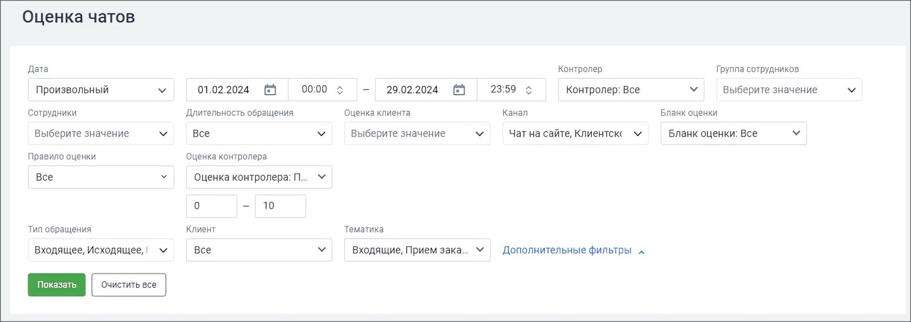
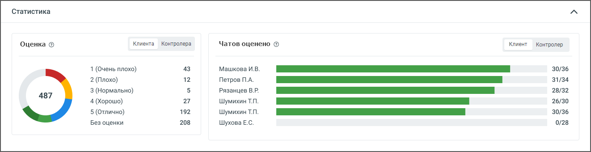
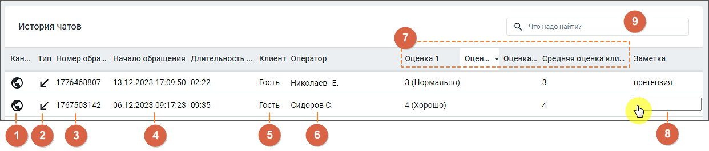
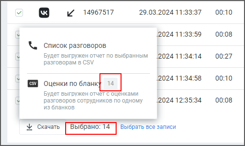

# 3.2. Оценка чатов

> Трассировка: PDF §3.2 · сквозные стр. 27-32 · источники: ч.1 `kb/sources/quality-managment/QM_manual_v-1.26.18.pdf` с.27-32.

Отчет предназначен для анализа и оценки эффективности текстовой коммуникации с клиентом. Он предоставляет возможность выделить и проанализировать данные об обращениях клиентов через различные каналы коммуникации сотрудниками компании. Отчет "Оценка чатов" содержит данные о качестве работы сотрудников ВАТС в соответствии с заданными параметрами фильтрации, и состоит из трех блоков: • Блок настройки параметров фильтрации • Блок визуализации • Блок таблицы НАСТРОЙКА ПАРАМЕТРОВ ФИЛЬТРАЦИИ

Для построения отчета воспользуйтесь следующими фильтрами (основными и дополнительными): 1. Период: • текущий день; • последние 2 дня; • текущая неделя; • текущий месяц; • произвольный (протяженностью не более 3-х месяцев). При входе в модуль загружаются обращения за текущий день. 2. Контролер – список контролеров. 3. Группа сотрудников – при выборе групп сотрудников сформированный отчет будет включать данные только по выбранным группам. Для быстрого выбора всех групп предусмотрен элемент списка "Все группы". Также в списке имеется вариант "Без группы". 4. Сотрудники – при выборе сотрудников сформированный отчет будет включать данные только по выбранным сотрудникам. Для быстрого выбора всех сотрудников предусмотрен элемент списка "Все сотрудники". Список также включает удаленных сотрудников (если сотрудники, которые участвовали во внешних разговорах за указанный период, были удалены). 5. Длительность обращения – продолжительность диалога. Варианты: • Все (установлен по умолчанию) • до 1 минуты • до 5 минут • от 5 до 20 минут • от 20 до 60 минут • более 60 минут • произвольный (при выборе этого варианта отображается дополнительная шкала выбора длительности) 6. Оценка клиента – в столбце отображается информация об оценке диалога клиентом. Доступны варианты: Все, 1 (Очень плохо), 2 (Плохо), 3 (Нормально), 4 (Хорошо), 5 (Отлично), Без оценки. 7. Канал – текстовые каналы коммуникации с клиентом.

8. Бланки оценки – при выборе бланков оценок сформированный отчет будет включать данные только по выбранным бланкам. Для быстрого выбора предусмотрен элемент списка "Все". 9. Правило оценки – при выборе правила клиентской постзвонковой оценки сформированный отчет будет включать данные только по выбранным правилам. Для быстрого выбора предусмотрен элемент списка "Все". 10. Оценка контролера – в столбце отображается информация об оценке звонка контролером. Доступны варианты: Все оценки, Без оценки, Произвольные значения (от 0 до 10). По умолчанию установлено значение "Все оценки". Фильтр отображает данные с учетом веса бланка. 11. Тип обращения – варианты: • Все – в результатах будут показаны все обращения, в которых принимал участие какой-либо пользователь; • Входящие – в результатах будут показаны все входящие внешние обращения. • Исходящие – в результатах будут показаны все исходящие внешние обращения. • Проактивный чат – в результатах будут показаны диалоги клиента в проактивном чате. 12. Клиент – выпадающий список содержит клиентов из Адресной книги. Имеется поле для быстрого поиска клиентов. При выборе определенных клиентов сформированный отчет будет включать данные только по выбранным клиентам. Для быстрого выбора предусмотрен элемент списка "Выбрано все". 13. Тематика – фильтр по тематике обращения, проставленной в Контакт-центре. Иерархия выпадающего списка БЛОК ВИЗУАЛИЗАЦИИ Клик по кнопке Свернуть/Показать скрывает или разворачивает блок визуализации. В блоке визуализации отображаются: • Оценка – диаграмма оценок клиента; • Разговоров оценено – количество разговоров, оцененных клиентом в разрезе по сотрудникам; Оценка На диаграмме отображено распределение вызовов в соответствии с оценками клиента, или контролера, в зависимости от отображаемого графика.

Элементы диаграммы могут использоваться в качестве фильтра по оценке клиента. Для этого необходимо нажать на область определенной оценки в самой диаграмме, либо в строке соответствующей оценки. После этого в таблице и других графиках будут показаны только записи с соответствующей оценкой. Могут быть выбраны несколько оценок. При повторном нажатии на запись или область диаграммы, фильтр снимается.

| Примечание: При установке фильтра по оценке данные в таблице и других графиках обновляются |
| --- |
| автоматически. |

Варианты оценок: • 1 (Очень плохо); • 2 (Плохо); • 3 (Нормально); • 4 (Хорошо); • 5 (Отлично); • Без оценки; Для каждой оценки приведено количество обращений, которым выставлена соответствующая оценка. РАЗГОВОРОВ ОЦЕНЕНО На диаграмме отображается количество диалогов, оцененных клиентом в разрезе по сотрудникам:

1. ФИО сотрудника 2. Шкала заполнения, которая показывает соотношение общего количества обращений, обработанных данным сотрудником, к обращениям, которые были оценены. 3. Информация о вызовах сотрудника, где: • первое число – количество обращений, оцененных клиентом; • второе число – общее обращений, обработанных данным сотрудником.

Элементы диаграммы могут использоваться в качестве фильтра по сотруднику. Для этого необходимо нажать на строку сотрудника в самой диаграмме, после этого в таблице и других графиках будут показаны только записи по соответствующему сотруднику. Могут быть выбраны несколько сотрудников. При повторном нажатии на строку, фильтр снимается.

| Примечание: При установке данного фильтра данные в таблице и других графиках обновляются |
| --- |
| автоматически. |

БЛОК ТАБЛИЦЫ В блоке таблицы отображаются данные о качестве работы сотрудников ВАТС в соответствии с заданными параметрами фильтрации. По умолчанию обращения отсортированы по дате/времени начала диалога. Таким образом, последние обращения расположены вверху таблицы.

1. Канал обращения – текстовые каналы обращения клиента. 2. Тип вызова – входящий, исходящий, проактивный чат. 3. Номер обращения – уникальный ID обращения. 4. Начало обращения и длительность обращения – время первого обращения в чате и общая длительность диалога. 5. Клиент – номер телефона или имя клиента из адресной книги. При щелчке по имени клиента открывается Карточка клиента. 6. Оператор – сотрудник компании, обрабатывающий обращение. 7. Оценка 1...Средняя оценка – все оценки, проставленные обращению, а также средняя оценка. 8. Заметка – комментарий к обращению (если имеется). Введенный текст сохраняется "на лету". 9. Поле поиска по результатам фильтрации. Клик по строке обращения в таблице открывает окно соответствующего чата для просмотра диалога. Предусмотрен экспорт диалогов в формате CSV. После отметки в чекбоксах выбранных диалогов и клика на кнопку «Скачать» открывается диалоговое окно, позволяющее экспортировать: • список разговоров – экспорт данных в соответствии с настройками, выбираемыми во всплывающем окне; • оценки по бланку – экспорт данных по бланку, выбираемому во всплывающем окне (с числом разговоров, доступных для экспорта). Отсутствует, если среди выбранных разговоров нет ни одного с оценкой контролера;

В отчете отображаются дата и время, когда был совершен звонок.
