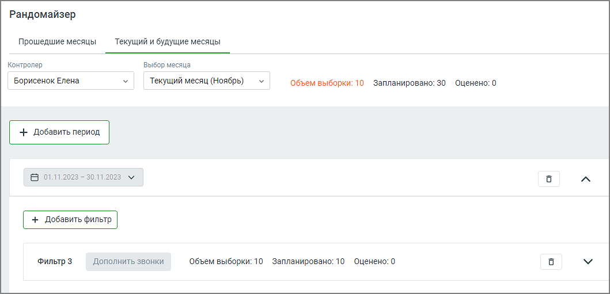

# 3.3. Рандомайзер

> Трассировка: PDF §3.3 · сквозные стр. 32-34 · источники: ч.1 `kb/sources/quality-managment/QM_manual_v-1.26.18.pdf` с.32-34.

На вкладке контролер имеет возможность отбирать произвольные разговоры сотрудников случайным образом. Это позволяет повысить объективность оценки качества обслуживания за счет независимого отбора исследуемых разговоров. Для начала отбора звонков необходимо выбрать контролера, а также один или несколько периодов, в которых будет производиться отбор. Каждый период по умолчанию составляет один календарный месяц. Допустимый диапазон выбора – прошедший и будущий год, считая от текущего месяца. Для каждого периода можно задать один или несколько наборов фильтров отбора.

Для построения списка разговоров воспользуйтесь следующими фильтрами: 1. Длительность вызова – продолжительность звонка. • все – параметр, установленный по умолчанию; • короткие – до 30 секунд; • средние – от 30 секунд до 5 минут; • длинные – более 5 минут; • произвольная длительность в формате: от мм:сс до мм:сс; 2. Количество звонков – желаемое количество разговоров, которые выберет система. 3. Правило постзвонковой оценки – при выборе правила оценки сформированный список будет включать данные только по выбранным бланкам. Для быстрого выбора предусмотрен элемент списка "Все". 4. Оценка клиента – при выборе какой-либо постзвонковой оценки разговора сформированный список будет включать разговоры только с этой оценкой. Доступны варианты: Все, 1 (Очень плохо), 2 (Плохо), 3 (Нормально), 4 (Хорошо), 5 (Отлично). 5. Группы – при выборе групп сотрудников сформированный список будет включать разговоры только по выбранным группам. Для быстрого выбора всех групп предусмотрен элемент списка "Все группы". Также в списке имеется вариант "Без группы". 6. Сотрудники – при выборе сотрудников сформированный список будет включать данные только по выбранным сотрудникам. Для быстрого выбора всех сотрудников предусмотрен элемент списка "Все сотрудники". Список также включает удаленных сотрудников (если сотрудники, которые участвовали во внешних разговорах за указанный период, были удалены). Клик по кнопке Показать формирует произвольный список разговоров, отобранных случайным образом.

