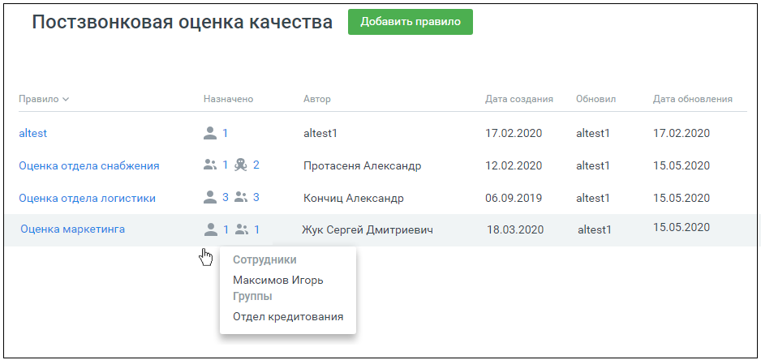
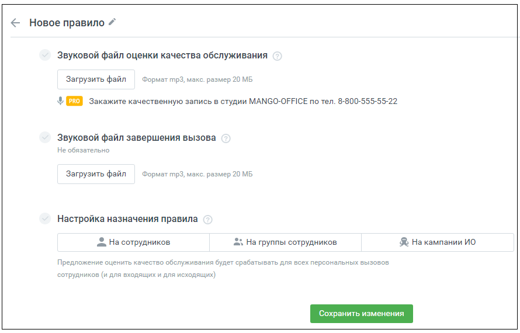
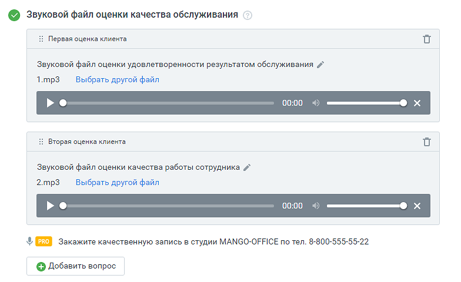
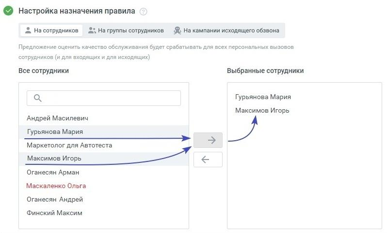
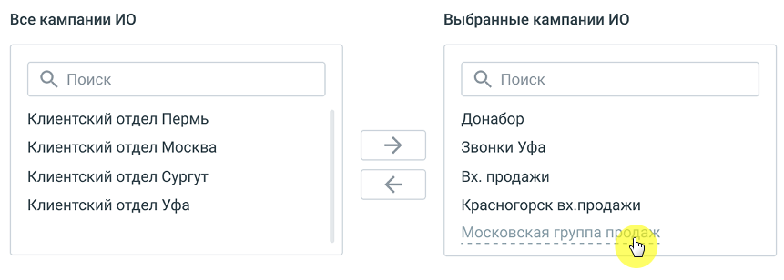

# 4.1. Настройка правил постзвонковой оценки

> Трассировка: PDF §4.1 · сквозные стр. 34-38 · источники: ч.1 `kb/sources/quality-managment/QM_manual_v-1.26.18.pdf` с.34-38.

Постзвонковая оценка качества предназначена для оценки: • персональных вызовов сотрудников (внешних входящих и исходящих); • вызовов, поступающих на группу сотрудников; • кампании исходящего обзвона с участием сотрудника (роботизированным кампаниям ИО правило оценки качества не назначается). Постзвонковая оценка качества предназначена для оценки клиентом работы сотрудника по завершении звонка. Рабочая область вкладки содержит список настроенных правил постзвонковой оценки качества:

Применяются следующие обозначения:

– правило назначено на персональные вызовы сотрудников;

– правило назначено на вызовы для групп сотрудников;

– правило назначено на вызовы, совершаемые в рамках кампании Исходящего обзвона. Правила постзвонковой оценки качества можно: • создавать • редактировать • удалять

| Примечание: Если для вызовов на группу сотрудников, персональных вызовов или кампании |
| --- |
| Исходящего обзвона настроено несколько правил, действительным является правило, |
| настроенное последним. |

Добавление правила постзвонковой оценки качества Для добавления нового правила зайдите в раздел Настройки/Постзвонковая оценка качества и нажмите кнопку Добавить правило.

Форма настройки правила содержит следующие поля: • Название правила – по умолчанию "Имя правила". Редактируется путем нажатия на

пиктограмму . Название правила не может повторять уже существующие названия правил проекта. • Звуковой файл оценки качества обслуживания – звуковой файл с предложением клиенту оценить качество работы сотрудника. Загружается пользователем. Допустимый формат файла – mp3. Максимальный размер 20 МБ. Загруженный звуковой файл можно прослушать во встроенном плеере, заменить или удалить.

При создании нового правила загрузка звукового файла оценки является обязательной. После ввода клиентом оценки (цифры от 1 до 5) введенное значение сохраняется как "Оценка клиента".

| Примечание: При подключенной в Личном кабинете пользователя ВАТС услуге «Контроль |
| --- |
| качества (постзвонковая оценка)», допускается размещение до трех звуковых файлов с |
| вопросами клиенту, с получением оценки клиента по каждому. В таблицах и графиках |
| отражается статистика по каждой из оценок. |

• Звуковой файл завершения вызова – звуковой файл, который услышит клиент после оценки работы сотрудника. Загружается пользователем. Допустимый формат файла – mp3. Максимальный размер 20 МБ. Загруженный звуковой файл можно прослушать во встроенном плеере, заменить или удалить.

• Настройка назначения правил – сотрудник, группа сотрудников или компания Исходящего обзвона, для которых действует данное правило.

Выделите сотрудников в поле "Все сотрудники" и нажмите кнопку . В поле "Выбранные сотрудники" отразится список сотрудников, которым назначено данное правило оценки. Чтобы удалить сотрудников из правила оценки, выделите их в поле "Выбранные сотрудники" , и нажмите

.

| Примечание: Если на выбранного сотрудника (группу, кампанию ИО) ранее уже было назначено |
| --- |
| правило, в поле "Все сотрудники" его имя выделено красным цветом. |

Аналогичным образом правила оценки назначаются на группы сотрудников и на кампании Исходящего обзвона.

Если кампания Исходящего обзвона имеет статус "Обрабатывается", "Выполняется" или "Останавливается", она отображается в настройках правила оценки качества, но удалить из правила ее нельзя. Для удаления такой кампании необходимо предварительно изменить ее статус. После заполнения полей формы сохраните внесенные изменения нажатием кнопки Сохранить.

| Примечание: Одно и то же правило может быть привязано одновременно к персональным |
| --- |
| вызовам сотрудников, вызовам, поступающим на группы и кампаниям исходящего обзвона. |

Просмотр и редактирование правила постзвонковой оценки качества Просмотр правила доступен из рабочей области вкладки. Для просмотра правила щелкните по его наименованию. Отредактируйте правило и сохраните внесенные изменения кнопкой Сохранить. Удаление правила постзвонковой оценки качества Для удаления созданного ранее правила откройте правило и нажмите кнопку "Удалить". Подтвердите свое согласие на удаление. Удаленное правило восстановить невозможно.
