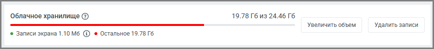
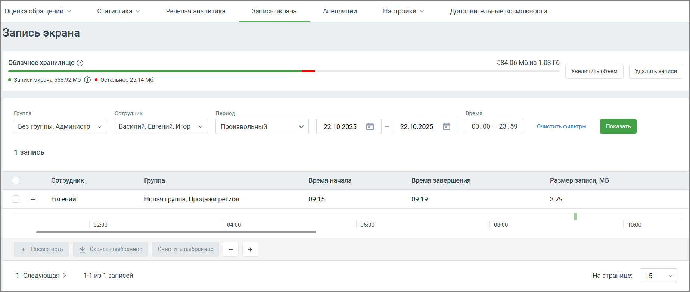

# 5.1. Просмотр и скачивание записей

> Трассировка: PDF §5.1 · сквозные стр. 41-43 · источники: ч.1 `kb/sources/quality-managment/QM_manual_v-1.26.18.pdf` с.41-43.

Раздел предназначен для просмотра списка, выбора и скачивания видео-записей экрана сотрудников компании. Чтобы открыть страницу с перечнем имеющихся записей экрана, выберите строку Запись экрана в горизонтальном меню. Данный раздел предоставляет руководителям возможность отслеживать активность сотрудников, находящихся в различных группах, за определенный период времени.

| ВАЖНО: По умолчанию раздел доступен только сотрудникам со стандартными ролями |
| --- |
| "Администратор" и "Руководитель компании". Для остальных ролей возможность доступа может |
| быть настроена индивидуально в ЛК ВАТС, разделы Безопасность → Настройка доступа → |
| Инструменты → Контроль качества. |

Технические требования к оборудованию 1. Требования к компьютеру (ПК, ноутбук, нетбук): • Операционная система: Windows 10, 11 (64-разрядная); • Процессор: Intel Core i5 8500 и выше; • Оперативная память: 16 ГБ; • Свободное место на диске: не менее 500 мб; • Широкоформатный монитор: 1280 x 800 2. Минимальный рекомендуемый объем локального хранилища на ПК оператора под функционал записи экрана – 10 гигабайт. В случае, свободное места в локальном хранилище ПК оператора < 3 Гб, запись экрана производиться не будет. 3. Запись экрана производится с использованием кодека h264 Облачное хранилище На странице Запись экрана отображается виджет Облачного хранилища, где доступна информация о следующих параметрах: • общий объём хранилища; • объём, занятый файлами записи экрана; • объём, занятый другими модулями (суммарно); • объём свободного места.

Также доступны следующие действия

• увеличить объём хранилища в разделе Личный кабинет → Дополнительные настройки → Облачное хранилище; • очистить место, удалив файлы записи экрана.

Основные элементы и функции данного интерфейса: 1. Фильтры для поиска записей: • Группа: Выберите группу сотрудников, чьи записи экрана вы хотите просмотреть. • Сотрудник: Позволяет выбрать конкретного сотрудника из выбранной группы или просмотреть записи всех сотрудников. • Период: Укажите временной диапазон, за который необходимо просмотреть записи. Варианты: Текущий день, Вчера, Последние 2 дня, Произвольный. Длительность произвольного периода не может превышать 2 дня. • Время: Укажите конкретное время в течение дня, которое вас интересует. Вы можете очистить выбранные временные фильтры с помощью кнопки «Очистить фильтры». После установки нужных фильтров нажмите кнопку «Показать» для отображения списка записей. 2. Список записей (таблица отчета): • Сотрудник: Имя сотрудника, чья запись отображена. • Группа: Группы, к которым относится сотрудник. • Время начала: Время начала записи экрана (не учитывая часового пояса). • Время завершения: Время завершения записи экрана (не учитывая часового пояса). • Размер записи, МБ: Общий размер записей по сотруднику за выбранный период.

3. Кнопка режима просмотра: кнопка слева от имени сотрудника управляет отображением таймлайна. • «+» — раскрывает ленту времени и дополнительные элементы управления (Посмотреть, Скачать выбранное, Очистить выбранное). • «–» — сворачивает запись до уровня сотрудника, скрывая детали. 4. Таймлайн (лента времени): Отображает интервалы, в которые велась запись экрана. • Шаг шкалы — 2 часа, начиная с 00:00. Зелёные участки обозначают наличие записей. Клик по фрагменту таймлайна выбирает данный фрагмент для просмотра (открывается встроенный плеер), скачивания или удаления.

| ВАЖНО: При использовании таймлайна возможность выбора записей ограничена до 1 часа, с |
| --- |
| учетом остатка доступного времени записи. Например, если уже выбрано 4 отрезка записи общей |
| длительностью 55 минут, можно выбрать еще один отрезок. |

5. Кнопка Посмотреть: Позволяет просмотреть выбранные записи прямо в системе. • Кнопка доступна после выбора одного или нескольких участков на таймлайне. • После подготовки видеозапись открывается во встроенном видеоплеере. ВАЖНО: Записи корректно воспроизводятся только в браузере Google Chrome. 6. Кнопка Скачать выбранное: Позволяет скачать выбранные фрагменты записи на компьютер. 7. Кнопка Очистить выбранное: Сбрасывает выделение всех участков на таймлайне. Чтобы установить или просмотреть настройки записей экрана пройдите в раздел Настройки → Запись экрана.

| ВАЖНО: ООО «Манго Телеком» не несет ответственности за соответствие процедуры записи |
| --- |
| экранов сотрудников компании требованиям законодательства. Обязанность по обеспечению |
| законности данного процесса возлагается на компанию. |
