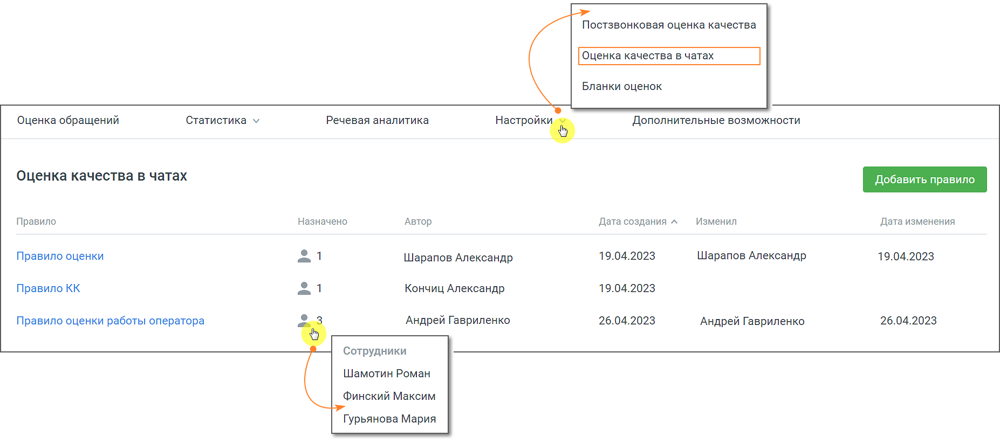

# 6. Оценка качества в чатах

> Трассировка: PDF §6 · сквозные стр. 48 · источники: ч.1 `kb/sources/quality-managment/QM_manual_v-1.26.18.pdf` с.48.

Вкладка Оценок качества в чатах предназначена для оценки работы сотрудника клиентом по завершении диалога в чате. Рабочая область вкладки содержит список всех правил оценки (максимальное количество – 50).

Параметры правил оценки: • Название – наименование правила оценки; • Назначено – сотрудники или группы, которым было назначено данное правило. Вопросы, содержащиеся в правиле, будут заданы клиенту после завершения разговора с указанными сотрудниками или группами; • Автор – ФИО сотрудника, создавшего правило оценки. Если сотрудник удален, то отображается "Удаленный сотрудник"; • Дата создания – дата создания правила оценки в формате дд.мм.гггг; • Изменил – ФИО сотрудника, который последним сохранил изменения в правиле. Если сотрудник удален, то отображается "Удаленный сотрудник"; • Дата изменения – дата последнего изменения правила в формате дд.мм.гггг.
