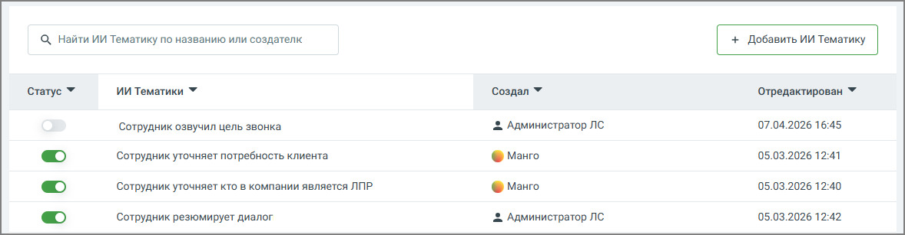
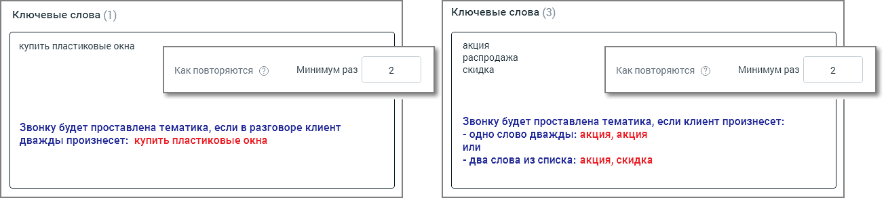

# 9.3. Вкладка ТЕГИРОВАНИЕ РАЗГОВОРОВ

> Трассировка: PDF §9.3 · сквозные стр. 69-72 · источники: ч.1 `kb/sources/quality-managment/QM_manual_v-1.26.18.pdf` с.69-72.

Рабочая область вкладки «Тегирование разговоров» содержит список всех Тематик и ИИ Тематик, созданных на продукте ВАТС. Тематика может иметь статус Активна/Неактивна. Распознанному звонку может присваиваться только активная тематика. Максимальное количество тематик в рамках одного продукта ВАТС – 200. По достижении лимита появляется окно уведомления о необходимости удалить ранее созданные неактуальные тематики.

Рис.1–Тематики

Рис.2 –ИИ Тематики

Тумблер (в демоверсии цвет включенного тумблера – желтый) для новых тематик по умолчанию включен. Система проверяет на вхождение только записи, распознанные после включения тумблера; 1. Название тематики; 2. Пиктограмма «e-mail» – отображается в случае настроенного уведомления на E-mail и/или СМС; 3. Когда создана тематика – дата в формате "ДД.ММ.ГГГГ"; 4. Когда изменена тематика – дата в формате "ДД.ММ.ГГГГ"; 5. Кем создана тематика – ФИО, для всех тематик, кроме предустановленных; 6. Количество слов в тематике – общее количество распознанных и нераспознанных терм в составе тематики; 7. Количество не распознанных слов – общее количество нераспознанных терм в составе тематики на момент отображения данных. Чтобы добавить новую тематику, щелкните по кнопке Добавить тематику. Открывшееся окно содержит 3 блока: • Ключевые слова • Расширенные настройки (не более 3-х условий для одной тематики) • Настройки уведомлений Задайте необходимые условия и сформулируйте поисковые запросы-термы, разделяя их запятой или переносом строки. При вводе терм допускается использование следующих символов:

• Кавычки (" " или «») – для поиска точного соответствия поисковому запросу; • Дефис (тире) – для составных слов; • Буквы (кириллица, латиница); • Цифры (кроме отдельно стоящих); • Пробел; • Восклицательный знак (!).

В блоке есть возможность использовать искусственный интеллект для генерации синонимов к ключевым словам. Что увеличивает диапазон ключевых слов и расширяет возможности пользователя в анализе получаемых данных. Если срабатывают все заданные условия и звонку присваивается тематика, пользователь получает уведомление по электронной почте или посредством СМС-сообщения. Эти опции настраиваются в Блоке уведомлений.

