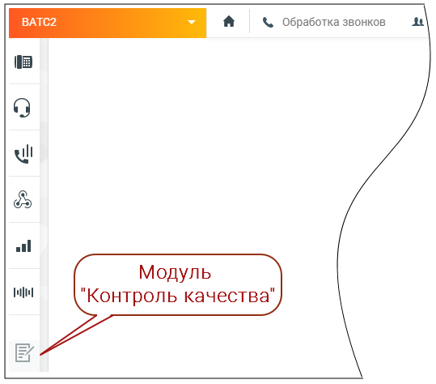
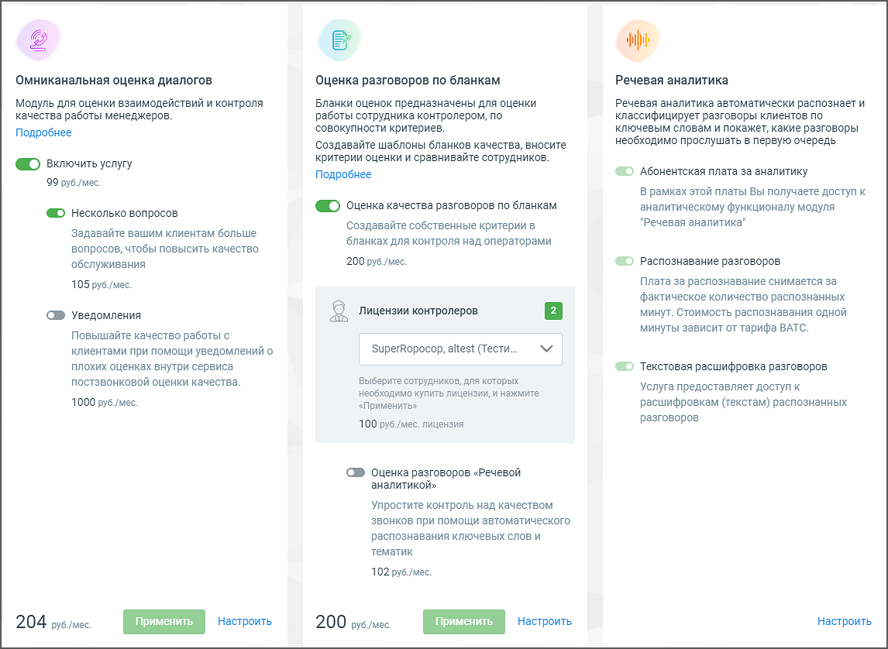

# 1.1. Как подключить модуль Контроль качества в Личном кабинете

> Трассировка: PDF §1.1 · сквозные стр. 4-5 · источники: ч.1 `kb/sources/quality-managment/QM_manual_v-1.26.18.pdf` с.4-5.

Доступ к модулю Контроль качества MANGO OFFICE осуществляется через браузер по адресу qm.mango-office.ru Для начала работы следует: • Подключить модуль "Контроль качества" в личном кабинете пользователя ВАТС; • Добавить пользователей, которые будут оценивать разговоры по бланкам оценки (контролеров); • Добавить правила оценки качества в чатах • Добавить бланки оценки разговоров • Настроить омниканальную оценку диалогов Чтобы подключить модуль войдите в Личный кабинет, выберите Виртуальную АТС, и кликните по значку модуля на левой вертикальной панели:

На экране отобразятся три блока модуля: ✓ Омниканальная оценка диалогов – оценка работы сотрудника клиентом. Включает в себя Постзвонковую оценку качества и Оценку качества в чатах; ✓ Оценка разговоров по бланкам – оценка работы сотрудника контролером; ✓ Речевая аналитика – распознавание разговоров и поиск (вручную или автоматически) необходимой информации в разговоре.

Ознакомьтесь с условиями и самостоятельно подключите блоки, проставив соответствующие переключатели и кликнув по кнопкам Применить или Подключить (в зависимости от выбранного блока и состояния услуги). После подключения блока необходимо произвести его настройки. В дальнейшем любой из блоков может быть отключен, либо пользователем могут быть изменены условия подключения. Для этого перейдите в раздел меню «Дополнительные возможности» модуля Контроля качества.
