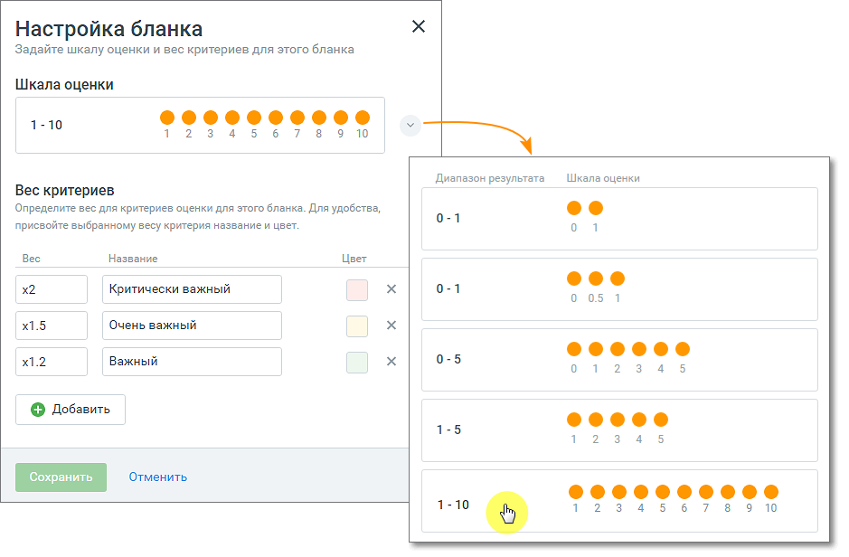

# 2.3. Настройка шкалы оценок и веса критериев

> Трассировка: PDF §2.3 · сквозные стр. 12-13 · источники: ч.1 `kb/sources/quality-managment/QM_manual_v-1.26.18.pdf` с.12-13.

Для настройки шкалы и веса критериев кликните по кнопке «Настроить бланк». В открывшемся окне выберите вкладку «Настройки бланка» со шкалой оценки из 10-ти возможных вариантов. Далее настройте коэффициенты оценок для данной шкалы. Возможно добавление до 10 коэффициентов. Каждый коэффициент содержит: Вес – в поле доступен выбор из настроенных весов критериев. Название – характеристика или иное пользовательское определение коэффициента, максимальная длина – 50 символов; Цвет – по клику в области поля открывается палитра выбора цвета; Пиктограмма удаления «х» – при удалении коэффициент удаляется у всех критериев бланка, которым он был ранее проставлен; Добавить – кнопка добавления нового веса критерия - число от 0,001 до 50 (дробные числа могут содержать до 3-х символов после запятой); Если значение коэффициента было изменено, то это значение коэффициента меняется для всех критериев бланка, которым он был проставлен.

