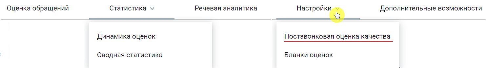

# 4. Настройка постзвонковой оценки

> Трассировка: PDF §4 · сквозные стр. 34 · источники: ч.1 `kb/sources/quality-managment/QM_manual_v-1.26.18.pdf` с.34.

Для настройки постзвонковой оценки пройдите в раздел меню Настройки Постзвонковая оценка качества.

