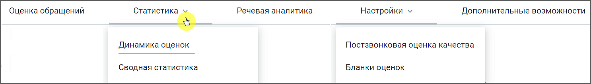
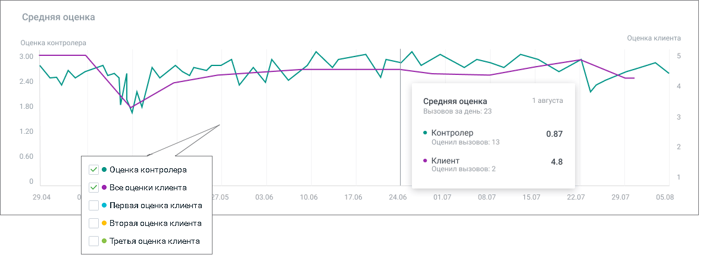
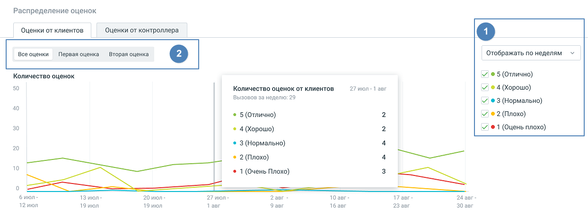
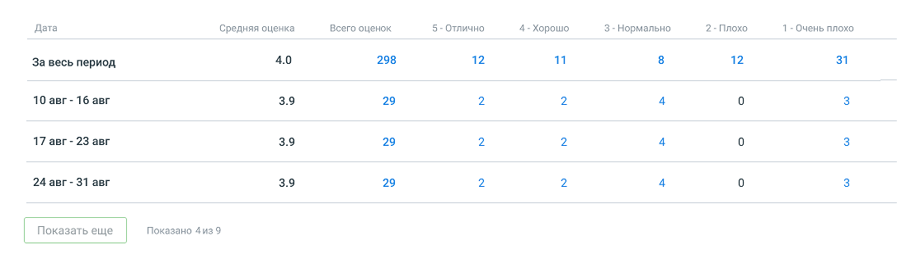
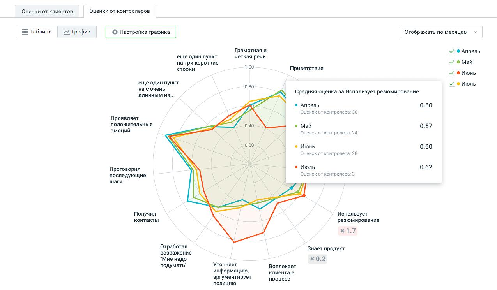
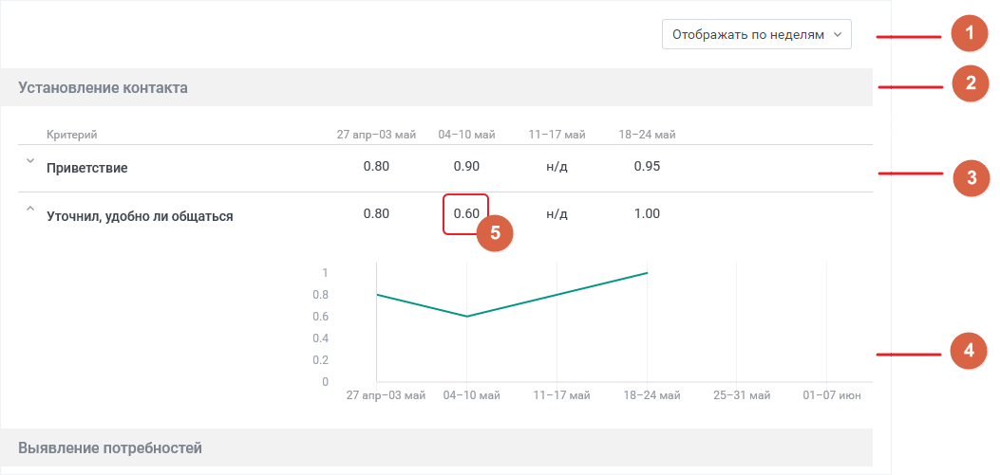

# 7.1. Динамика оценок

> Трассировка: PDF §7.1 · сквозные стр. 51-56 · источники: ч.1 `kb/sources/quality-managment/QM_manual_v-1.26.18.pdf` с.51-56.

Отчет "Динамика оценок" содержит данные о качестве работы сотрудников ВАТС в соответствии с заданными параметрами фильтрации. Отчет позволяет наглядно отследить динамику изменения оценки работы сотрудника клиентом и контролером, по срезу день/неделя/месяц. Отчет включает в себя: 1. График «Средняя оценка» – динамика оценок разговоров сотрудника как клиентом, так и контролером: 2. График «Распределение оценок» (с табличной частью) – данные об оценках клиентов и контролеров за выбранный период. Для построения отчета воспользуйтесь следующими фильтрами: • Период – фильтрует оцененные вызовы по дате создания вызова: Текущая неделя, Текущий месяц, Произвольный (максимальное значение 1 год); • Группа – выпадающий список содержит список групп, доступных пользователю, расположенных в алфавитном порядке; • Сотрудник – выпадающий список содержит сотрудников , относящихся к группе, выбранной во вкладке "Оценка звонков". Также в списке доступен выбор варианта «Результат по всей группе». • Бланк оценки – список всех доступных бланков оценки; • Правило оценки – список всех доступных правил постзвонковой оценки качества. Для формирования отчета установите параметры фильтрации и нажмите на кнопку Показать.

| Совет: Если кнопка Показать недоступна для нажатия, проверьте – во всех ли выпадающих |
| --- |
| списках выбраны данные для формирования отчета. |

ГРАФИК «СРЕДНЯЯ ОЦЕНКА» На горизонтальной оси – динамика по времени (в формате "дд.мм" – для периода менее 210 дней, "месяц" – для периода более 210 дней); На вертикальной оси – слева от графика расположены деления оценок контролеров, справа от графика расположены деления оценок клиентов.

При наведении курсора на элементы графика отображается всплывающая подсказка с информацией по соответствующему дню (с учетом выбранных оценок): • выбранная дата; • количество вызовов у сотрудников за день; • средняя оценка контролера за выбранный день; • количество разговоров, которые оценили контролеры, за выбранный день; • средняя оценка клиентов за выбранный день; • количество разговоров, которые оценили клиенты, за выбранный день. ГРАФИК «РАСПРЕДЕЛЕНИЕ ОЦЕНОК» На графике отображено распределение оценок (клиентов и контролеров) по выбранным сотрудникам.

Вкладка «Оценки от клиентов». График. По клику на период на графике, появляется информационное окно "Количество оценок от клиентов", с детализацией оценок сотрудников за выбранный период. Количество графиков зависит от выбранных в блоке «1» оценок. Блок «2» отображается при наличии нескольких звуковых файлов-вопросов в выбранных Правилах постзвонковой оценки. Таблица «Оценки от клиентов»

Таблица включает следующие данные для выбранных сотрудников: период, средняя оценка за период, детализация по оценкам за период. Кликнув на число, пользователь переходит в раздел Оценка звонков, с записями разговоров соответствующего периода. Клик по кнопке Скачать приводит к открытию стандартного окна экспорта данных. Экспорт производится в формат CSV, с учетом выбранных в фильтрах значений. Вкладка «Оценки контролеров». Диаграмма квалификаций. Лепестковая диаграмма квалификаций отображает оценки контролёров в разрезе выбранных периодов по каждому критерию или разделу выбранного бланка, в зависимости от периода отображения. График строится по оценкам по критериям/разделам без учета коэффициентов. Если в выпадающем списке Бланк оценки отмечено значение «Не выбран», вкладка не будет содержать никакой информации.

Максимальное количество одновременно отображаемых диаграмм – 5. Для настройки диаграммы следует кликнуть по кнопке Настроить график. В открывшемся окне выбрать критерии и разделы бланка оценки, сохранить внесенные изменения. Максимальное количество пунктов для построения диаграммы – 20. Клик по кнопке Отменить возвращает настройки к последнему сохраненному значению.

Таблица «Оценки контролеров»

Таблица формируется по срезу день/неделя/месяц и заданным пользователем фильтрам. Таблица включает следующие данные: 1. Переключатель группировки периодов – день, неделя, месяц. • Срез "дни" недоступен, если выбранный в фильтре период более 60 дней. • Если период охватывает дни из двух календарных лет, то над первым столбцом за каждый год указан соответствующий год. 2. Заголовок раздела бланка оценки. 3. Критерий бланка оценки – критерии, по которым не проставлены оценки, не отображаются. 4. Развернутый критерий – отдельный график с динамикой оценок контролера за выбранный

период. Сворачивается/разворачивается кликом по пиктограмме и , расположенной слева от наименования критерия. 5. Среднее значение критерия – среднее арифметическое значение оценок в выбранном временном срезе, с округлением до сотых.

