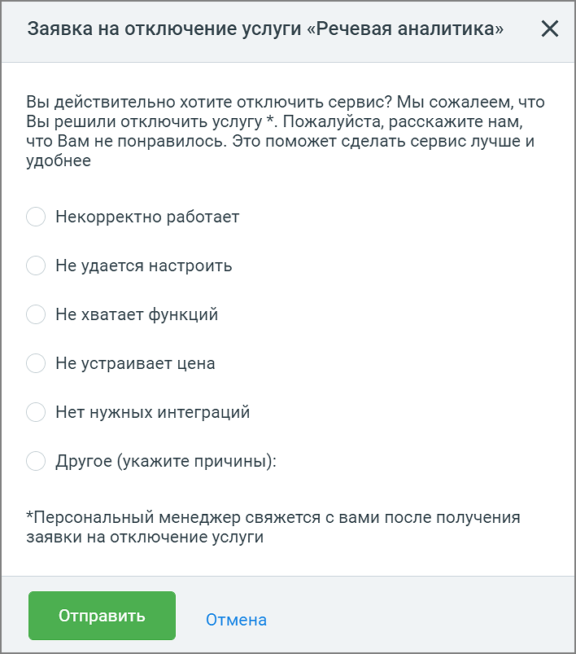

# 9.4.6. Отключение услуги

> Трассировка: PDF §9.4.6 · сквозные стр. 91-93 · источники: ч.1 `kb/sources/quality-managment/QM_manual_v-1.26.18.pdf` с.91-93.

При необходимости пользователь может отключить услугу Речевая аналитика. Для этого в разделе Настройки нажмите на ссылку Отключить.

В появившемся окне заполните и отправьте форму обратной связи с запросом на отключение услуги. Услуга будет отключена вашим Персональным менеджером.

На странице Настройки будет отображаться статус заявки на отключение. После отключения услуги пользователь полностью теряет доступ к функционалу услуги.

