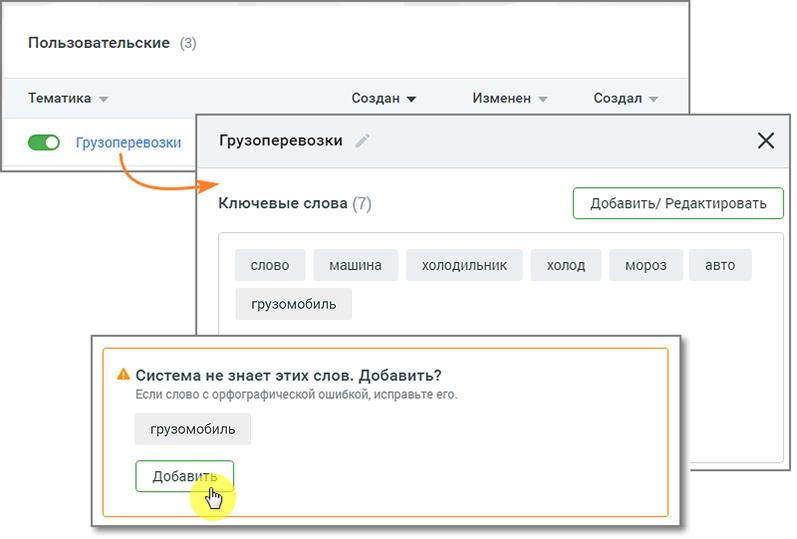
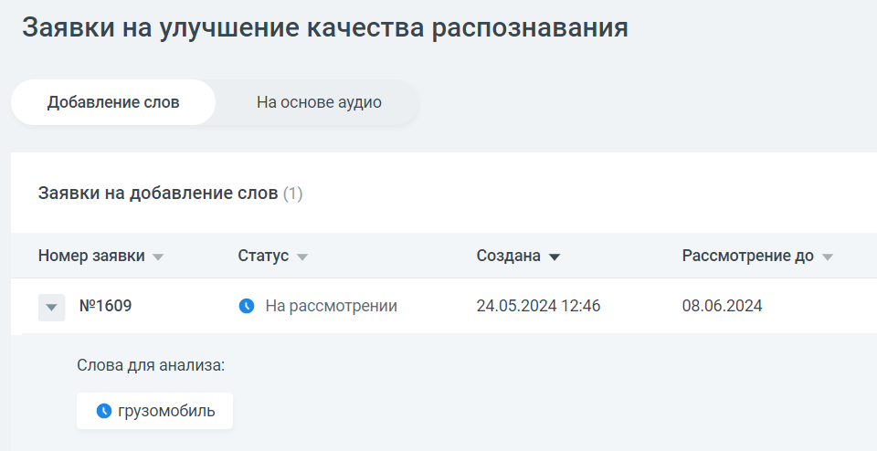

# 9.5. Вкладка ЗАЯВКИ

> Трассировка: PDF §9.5 · сквозные стр. 93-97 · источники: ч.1 `kb/sources/quality-managment/QM_manual_v-1.26.18.pdf` с.93-97.

Пользователь, который выбрал для распознавания технологию 3iTech, может отправить заявку на улучшение качества распознавания и отслеживать статус заявки в ЛК ВАТС.

| Важно: Для доступа пользователя к разделу необходимо наличие права «Просматривать и |
| --- |
| создавать/изменять тематики» |

Добавление слов Чтобы отправить заявку на добавление слова, которое не знакомо «Речевой аналитике», следует в разделе «Тематики» выбрать тематику, в которой имеются незнакомые слова, и открыть карточку тематики.

Внизу карточки тематики будет присутствовать уведомление о незнакомом слове и предложение добавить его в систему. Нажмите кнопку Добавить. Заявка отобразится в окне раздела «Заявки на улучшение качества распознавания», на вкладке «Добавление слов».

Окно заявки содержит следующие данные: • Номер заявки • Статус заявки – на рассмотрении, исправления приняты, исправления отклонены. • Дата создания заявки • Дата, до которой будет рассмотрена заявка Также в окне можно ознакомиться с предлагаемым для анализа словом.

На основе аудио Чтобы отправить заявку на основе аудиозаписи, в окне расшифровки записи разговора следует нажать кнопку Предложить исправления.

Далее внесите в текст требуемое исправление и нажмите кнопку Отправить на доработку. На экране отобразится окно системного уведомления:

Клик по ссылке открывает окно раздела «Заявки на улучшение качества распознавания», на вкладке «На основе аудио».

Окно заявки содержит следующие данные: • Номер заявки • Статус заявки – на рассмотрении, исправления приняты, исправления отклонены. • Дата создания заявки • Дата разговора и его длительность • Участники разговора и информация о звонке (входящий или исходящий) Также в окне можно ознакомиться с исходным и предлагаемым к замене текстом. О времени выполнения заявки пользователь уведомляется системным сообщением.

