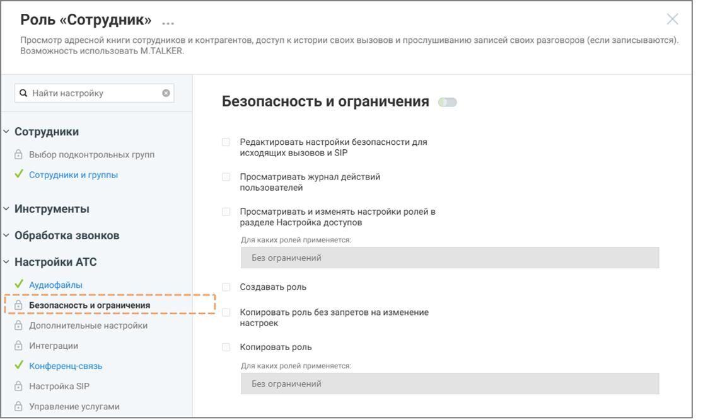

# 3.3.1. Копировать роль без запретов на изменение настроек

> Трассировка: PDF §3.3.1 · сквозные стр. 9-11 · источники: ч.1 `kb/sources/Rolevaya-model-vats/Rolevaya-model-VATS_1_26_08.pdf` с.9-11.

изменение настроек Данная строка меню доступна для нажатия если у пользователя активировано право доступа «Копировать роль без запретов на изменение настроек». внимание Важно понимать: копия роли наследует от источника только перечень доступных разделов. Если раздел был закрыт/открыт для исходной роли, после создания копии он останется аналогично закрытым/открытым, с возможностью последующего изменения доступа. Также внутри каждого унаследованного раздела копия получает возможность подключения полного набора всех возможных прав, даже если у источника они были отключены. После создания роли-копии обязательно отключите ненужные права, чтобы избежать избыточных разрешений. Чтобы создать роль на основе существующей, без запретов на изменение настроек: • откройте раздел Настройки АТС → Безопасность и ограничения • выберите системную роль, на основе которой будет создаваться пользовательская

• нажмите иконку контекстного меню и в выпадающем окне выберите вариант «Копировать роль без запретов на изменение настроек» • нажмите кнопку Создать роль • укажите название роли • при необходимости укажите описание роли • настройте права доступа роли Роли и права доступа | v. 1.26.08 9

| 8 800 555 55 22, mango-office.ru |  |
| --- | --- |
|  | mango@mangotele.com |

• нажмите Сохранить

Рисунок 4. Роль-источник

Рисунок 5. Роль-копия Роли и права доступа | v. 1.26.08 10

| 8 800 555 55 22, mango-office.ru |  |
| --- | --- |
|  | mango@mangotele.com |

На примере выше Рисунок 4 – роль-источник, Рисунок 5 – роль-копия. Роль-копия имеет возможности подключения разделов и подключения прав доступа внутри разделов, хотя роль- источник этой возможности не имеет.
