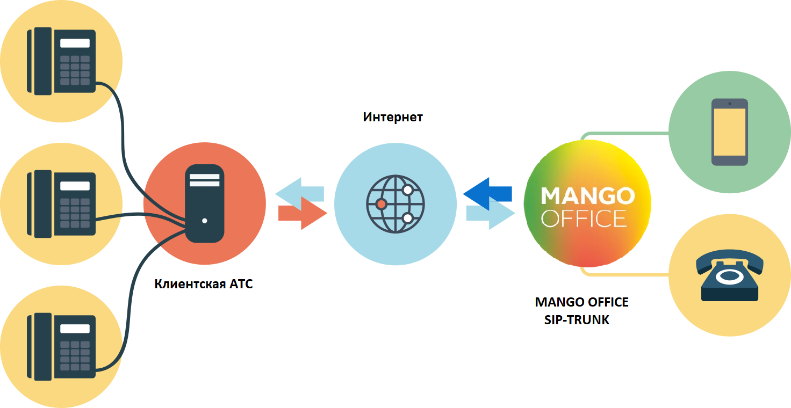

# 2. Что такое SIP Trunk

> Трассировка: PDF §2 · сквозные стр. 3-4 · источники: ч.1 `kb/sources/sip-trunk/MO_SIP_Trunk.pdf` с.3-4.

SIP Trunk – это виртуальный канал связи между вашей АТС (кАТС) и Виртуальной АТС MANGO OFFICE. Он позволяет объединить различные АТС в единую сеть и совершать внутренние, входящие и исходящие звонки независимо от того, к какой именно АТС принадлежит тот или иной сотрудник или телефонный номер.

