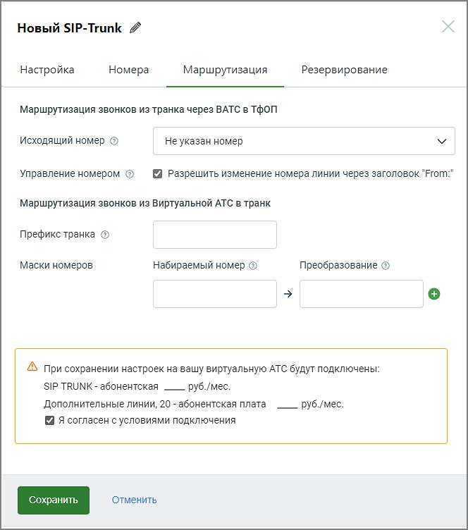

# 3.1.3. Маршрутизация

> Трассировка: PDF §3.1.3 · сквозные стр. 9-11 · источники: ч.1 `kb/sources/sip-trunk/MO_SIP_Trunk.pdf` с.9-11.

Заполните поля:

Исходящий номер - устанавливает АОН для исходящих вызовов по умолчанию. Если из кАТС будет получена команда на совершение исходящего вызова (т. е. номер не является внутренним номером сотрудника ВАТС), то он будет выпущен ВАТС в ТФОП с указанием выбранного в этом поле номера в качестве АОН. Можно выбрать только номера MANGO OFFICE, подключенные к данной ВАТС; Управление номером Если чек-бокс выключен, исходящий номер устанавливается по умолчанию. Пример, когда чек-бокс "Разрешить изменение номера" не установлен:

| ПРИМЕР 1. Для транка в качестве номера по-умолчанию указан 71234567890 |
| --- |
| и чек-бокс "Разрешить изменение номера" не установлен. Тогда для |
| исходящего звонка в ТфОП будет подставляться номер 71234567890. |

Если чек-бокс включен, из кАТС будет получена команда на совершение исходящего

|  | совпадающий с |
| --- | --- |
| номером Манго, подключенный к данной ВАТС, то в качестве АОН будет установлен |  |
| номер, полученный из кАТС; |  |

Если АОН по умолчанию не установлен и из кАТС не передан номер Манго, вызов не совершается. Примеры, когда чек-бокс "Разрешить изменение номера" установлен:

| ПРИМЕР 2. Для транка в качестве номера по-умолчанию указан 71234567890. |
| --- |
| Из клиентской АТС через транк инициируется звонок в ТфОП, при этом в |
| качестве номера инициатора указан 70123456789, которого нет среди |
| номеров Манго на данной ВАТС. Тогда для исходящего звонка в ТфОП будет |
| подставляться номер 71234567890. |

| ПРИМЕР 3. Для транка в качестве номера по-умолчанию указан 71234567890. |
| --- |
| Из клиентской АТС через транк инициируется звонок в ТфОП, при этом в |
| качестве номера инициатора указан 79876543210, который присутствует |
| среди номеров Манго на данной ВАТС. Тогда для исходящего звонка в ТфОП |
| будет подставляться номер 79876543210 |

Префикс транка - допускается ввод чисел от 1 до 9999. Префикс исключается из набранного номера. Необязательный параметр.

| При вводе сотрудником этого префикса перед набором номера, звонок принудительно |
| --- |
| будет направлен ВАТС в соответствующий транк. |

| ПРИМЕР 4. Сотрудник ВАТС набирает 88123456. В транк, для которого |
| --- |
| установлен префикс 88, будет отправлен звонок на номер 123456. |

Маски номеров - набираемый номер и преобразование номера. Если набранный номер соответствует маске номера транка, то набранный номер преобразовывается в соответствии с правилом преобразования для данной маски данного транка и направляется в этот транк. ПРИМЕР 5. На кАТС созданы сотрудники с внутренними номерами в диапазоне от 100 до 500 включительно. На ВАТС также создано несколько сотрудников с номерами от 501 до 550. Необходимо настроить телефонию так, чтобы сотрудники ВАТС при наборе короткого номера от 100 до 500 попадали на сотрудников в кАТС, а от 501 до 550 - в ВАТС. Решение: указать в поле “маска” ([1-4][0-9][0-9]|500), а в поле “преобразование номера” - $1. При звонках в транк: • если совпадение по маске/префиксу найдено - осуществляется маршрутизация в транк; • если найдено несколько совпадений по маске/префиксу - осуществляется маршрутизация в первый доступный транк с наименьшим идентификатором. Если основной SIP Trunk недоступен и для него на вкладке Резервирование указаны резервные транки, то звонок будет инициирован через первый резервный транк, указанный для основного. Более подробно примеры настройки маршрутизации приведены в разделе 6.
