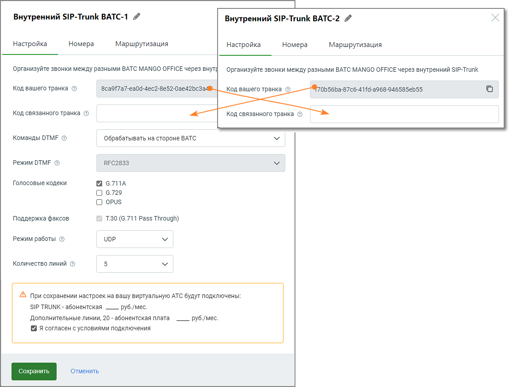

# 3.2.1. Настройка

> Трассировка: PDF §3.2.1 · сквозные стр. 13-14 · источники: ч.1 `kb/sources/sip-trunk/MO_SIP_Trunk.pdf` с.13-14.

Для настройки внутреннего SIP Trunk необходимо установить связь между двумя ВАТС, прописав соответствующие параметры, которые позволят им взаимодействовать между собой. Это обеспечит внутренние коммуникации между филиалами или частями одной и той же компании через SIP Trunk.

При заполнении остальных полей формы, руководствуйтесь инструкциями, предоставленными в разделе Настройки для внешнего SIP Trunk.
