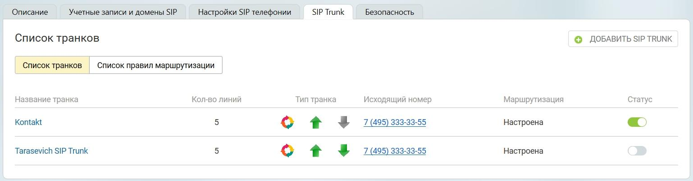

# 4.1. Список транков

> Трассировка: PDF §4.1 · сквозные стр. 18 · источники: ч.1 `kb/sources/sip-trunk/MO_SIP_Trunk.pdf` с.18.

Название транка - название транка, установленное пользователем; Количество линий - максимальное количество одновременных звонков, устанавливаемое пользователем во вкладке «Настройки»; Тип транка - направление вызова для данного транка, устанавливаемое пользователем во вкладке «Номера»;

● исходящие вызовы

● входящие вызовы

● для данного транка установлены правила маршрутизации звонков;

● для данного транка не установлены правила маршрутизации звонков; Исходящий номер - номер, установленный в качестве исходящего во вкладке «Маршрутизация»; Маршрутизация - поле имеет статус “настроена”, если пользователь указал префикс транка или маски номеров во вкладке «Маршрутизация»; Статус транка :

| у транка присутствует подключение; |
| --- |
| у транка отсутствует подключение; |

● транк деактивирован;
