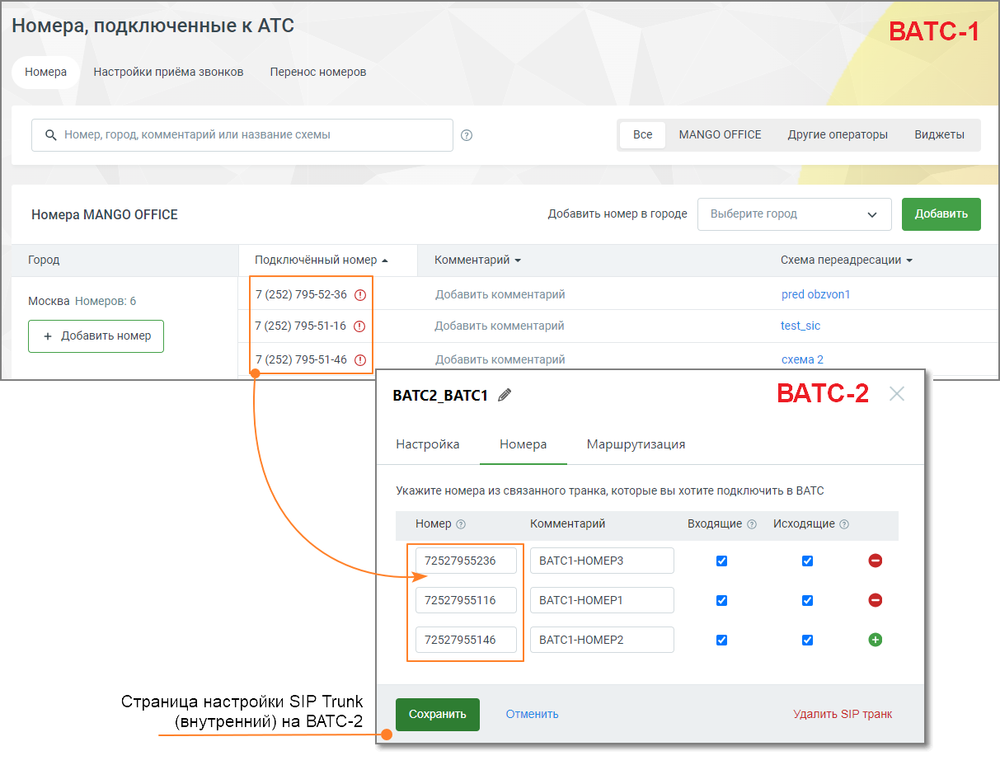
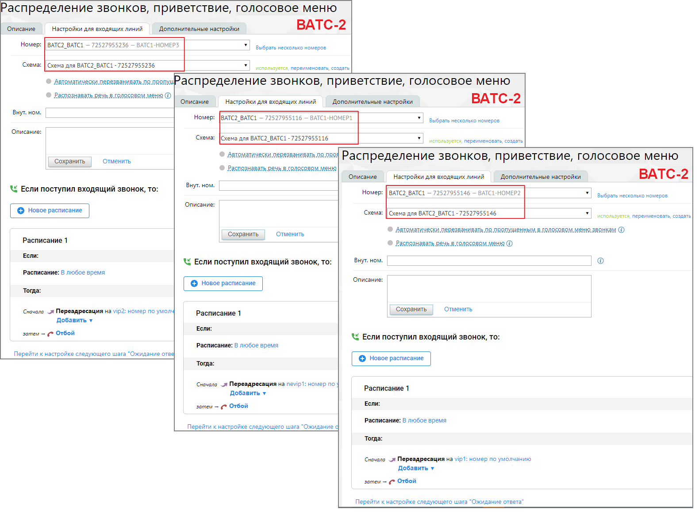
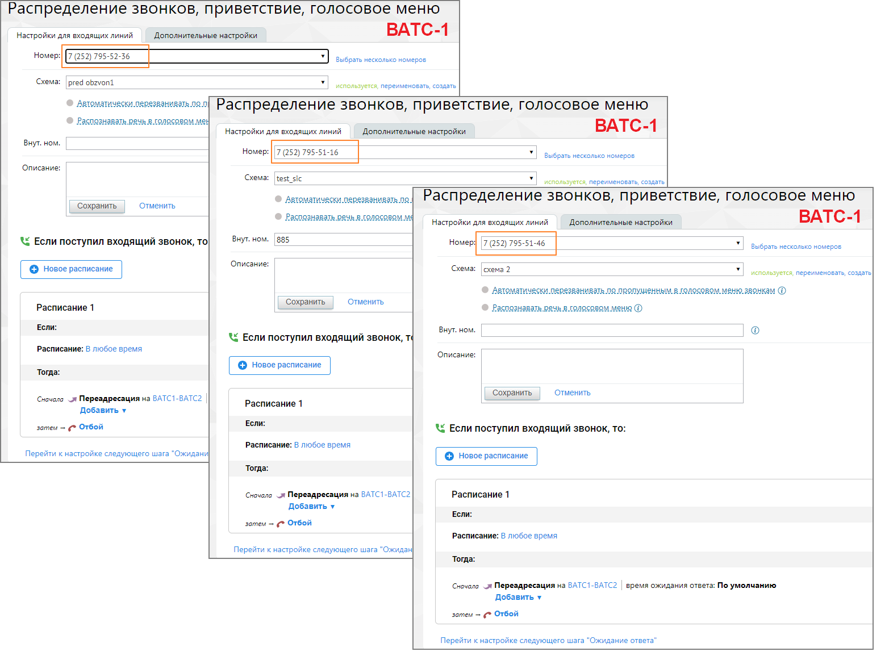
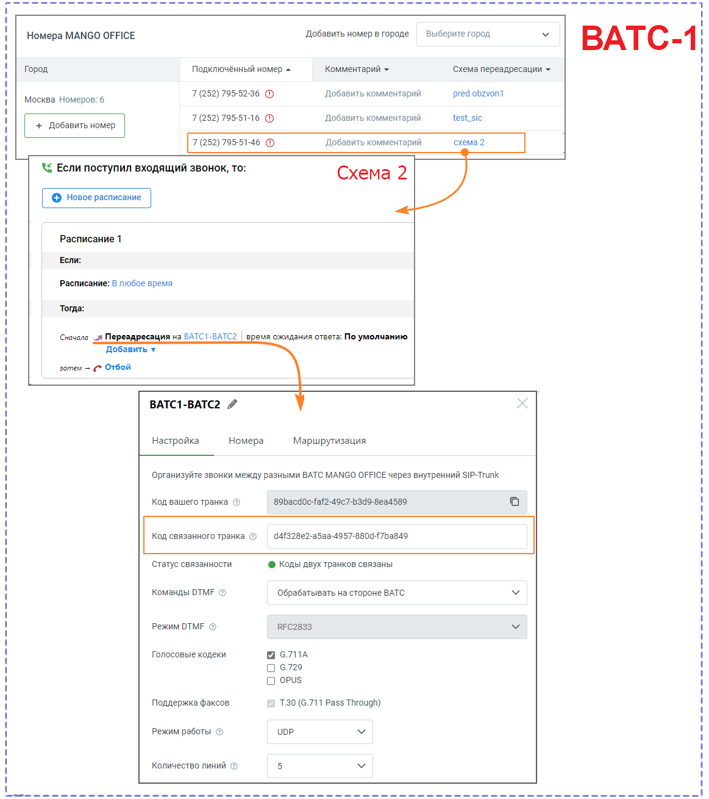
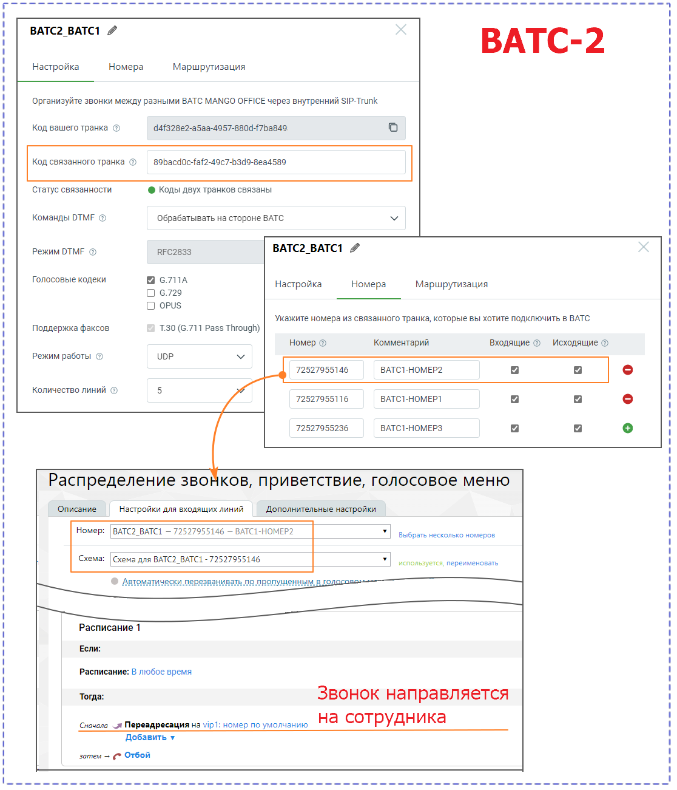
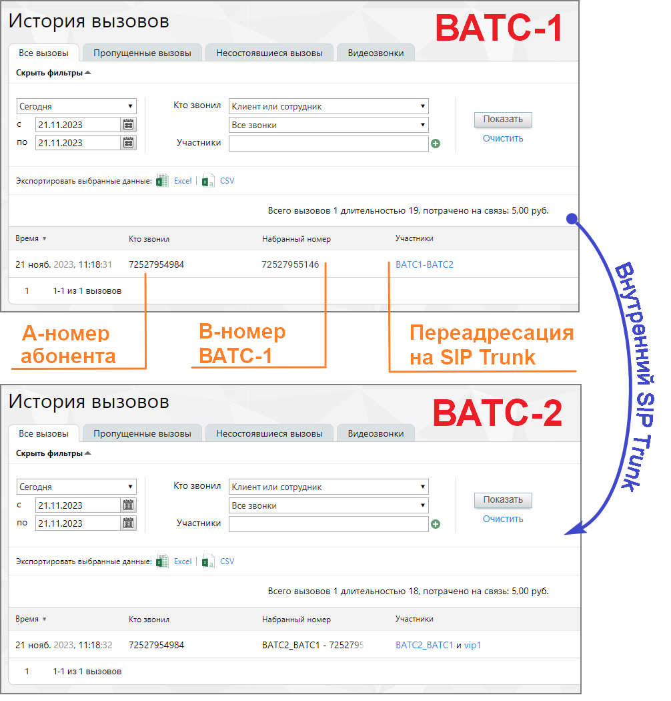

# 6. Примеры настройки звонков через SIP Trunk

> Трассировка: PDF §6 · сквозные стр. 22-30 · источники: ч.1 `kb/sources/sip-trunk/MO_SIP_Trunk.pdf` с.22-30.

Для совершения исходящих вызовов ВАТС должна знать какой номер, в каком формате, и по какому транку ей передать. Во вкладке «Маршрутизация» пользователь может создать несколько масок номеров. Маски перебираются по порядку сверху вниз, и как только находится совпадение в шаблоне номера, вызов отправляется в соответствующий шаблону транк.

| СОВЕТ: Поскольку маски перебираются сверху вниз, первыми лучше создавать |
| --- |
| более детальные маски, например, с кодом города, после них делать маски с более |
| общей маской например мобильники, затем уже страну. Если сделать наоборот, то |
| сработает маска страны, но не сработают остальные. |

Пример 1. Пользователь кАТС звонит сотруднику, заведенному в ВАТС, по короткому номеру 456. Что необходимо сделать: 1. Создать SIP Trunk в Личном кабинете MANGO OFFICE. 2. Настроить правило исходящей маршрутизации в PBX (например, в Asterisk), указав во вкладке Dial Patterns правило для префикса 45 или правило для префикса 4. ● Prepend - поле остается пустым ● Prefix - поле остается пустым ● Match Pattern - 4ХХ или 45X Пример 2. Сотрудник из ВАТС совершает звонок в клиентскую АТС на номер 456. Что необходимо сделать: 1. Создать SIP Trunk в Личном кабинете MANGO OFFICE. 2. Создать правило исходящей маршрутизации во вкладке «Маршрутизация» для диапазона номеров кАТС, включающее номер 456. Например указать в поле “маска” ([1-4][0-9][0-9]|500), а в поле “преобразование номера” - $1. 3. Создать правило входящей маршрутизации в PBX (например, в Asterisk, заполнив поля вкладки Connectivity>Inbound Routes) Пример 3. Пользователь кАТС с номером 7499308808 совершает звонок в ВАТС. Что необходимо сделать: 1. Создать SIP Trunk в Личном кабинете MANGO OFFICE. 2. Настроить схему распределения входящих звонков на этот транк. 3. Настроить правило исходящей маршрутизации в PBX (например, в Asterisk), указав во вкладке Dial Patterns: ● Prepend - поле остается пустым ● Prefix - поле остается пустым ● Match Pattern - 7499308808 или 749930ХХХХХ Пример 4. Пользователь кАТС с номером 7499308808 совершает звонок через DID ВАТС на ТФоП. Что необходимо сделать: 1. Создать SIP Trunk, указав во вкладке «Маршрутизация» исходящий номер по умолчанию”. 2. Настроить правило исходящей маршрутизации, указав во вкладке Dial Patterns: ● Prepend - поле остается пустым

● Prefix - поле остается пустым ● Match Pattern - 7499308808 или 749930ХХХХХ Пример 5. Звонок сотрудника из ВАТС через DID клиентской АТС. Что необходимо сделать: 1. Создать SIP Trunk в Личном кабинете MANGO OFFICE, обязательно выставив отметку “Звонить” во вкладке «Номера». 2. В Карточке сотрудника установите транк для совершения исходящих вызовов. 3. Создать правило входящей маршрутизации в PBX (например, в Asterisk, заполнив поля вкладки Connectivity>Inbound Routes) Пример 6. Сотрудник ВАТС, у которого в качестве исходящего номера указан номер транка, набирает номер 123, который является внутренним номером другого сотрудника данной ВАТС. Результат: Звонок проходит как внутренний для данной ВАТС без использования транка. Пример 7. Настройка для звонка сотрудника из ВАТС-1 в ВАТС-2 Для настройки звонка из ВАТС-1 в ВАТС-2 с использованием префикса транка и/или маски номера, выполните следующую последовательность действий: 1. Настройка ВАТС1 ● Создайте или выберите существующий SIP-транк для связи с ВАТС-2. ● На вкладке "Маршрутизация" настройте префикс транка и/или маску номера в соответствии с форматом номеров на ВАТС-2. Примеры: Префикс транка: Если на ВАТС-2 у сотрудника внутренний номер 1001, укажите префикс "1001" или другой, который соответствует формату на ВАТС-2. Маска номера: Если внутренние номера на ВАТС-2 имеют формат "5xxx," укажите маску "5XXX" для преобразования номера перед отправкой. 2. Настройка ВАТС-2: ● На ВАТС-2 создайте или настройте сотрудника, группу или IVR с внутренним номером, который будет соответствовать префиксу транка или маске номера на ВАТС-1. Например, если на ВАТС1 префикс транка - "1001," создайте сотрудника с внутренним номером "1001" на ВАТС-2. ● Укажите необходимые настройки для обработки вызовов на этот внутренний номер на ВАТС-2, такие как переадресация на конкретного сотрудника, группу или выполнение действий IVR. 3. Звонок из ВАТС-1 в ВАТС-2: Теперь, чтобы совершить звонок из ВАТС-1 в ВАТС-2: • На ВАТС-1 наберите префикс транка (например, "1001") или номер, соответствующий маске номера (например, "5XXX").

• Затем наберите внутренний номер на ВАТС-2, с которым вы хотите установить связь. • ВАТС-1 автоматически преобразует введенный номер, добавляя префикс транка или применяя маску номера, и отправит вызов на ВАТС-2. • ВАТС-2 обработает вызов, перенаправив его на соответствующий внутренний номер, согласно настройкам. Таким образом, вы сможете вызывать внутренние номера на ВАТС-2 с ВАТС-1, используя префикс транка или маску номера для преобразования номера перед отправкой вызова. Пример 8. Настройка для звонка от клиента на ВАТС-2 через ВАТС-1 с использованием внутреннего транка и автоматического переадресации на IVR.

Для настройки звонка выполните следующую последовательность действий: 1. Настройка ВАТС-2: На ВАТС-2 у вас уже есть внутренний SIP-транк, на вкладке "Номера" которого указаны номера DID ВАТС-1, на который дозваниваются клиенты. На рисунке выше указаны три номера.

Создайте или настройте IVR на ВАТС-2, который будет обрабатывать входящие вызовы на указанные DID номера. IVR должен предоставить клиентам опции для навигации и выполнения различных действий. На рисунке ниже представлены настройки схемы переадресации ВАТС-2 для маршрутизации вызовов, полученных из внутреннего SIP Trunk, для каждого из трех номеров:

2. Настройка ВАТС-1: На ВАТС-1 необходимо только создать связанный внутренний SIP Trunk. Здесь не потребуется специальная настройка маршрутизации транка, так как весь сценарий будет инициирован на ВАТС-2. Однако потребуется настройка схемы распределения для маршрутизации вызовов с DID-номеров во внутренний транк. На рисунке ниже представлены настройки схемы переадресации ВАТС-1 для маршрутизации вызовов во внутренний SIP Trunk для каждого из трех номеров:

3. Звонок от клиента на ВАТС-2: • Клиент звонит на номер DID ВАТС-1, который указан на вкладке "Номера" в транке ВАТС-2: A-номер 7(252) 795-49-84 (внешний номер инициатора звонка) B-номер 7(252) 791-51-46 (DID номер принадлежит ВАТС-1)

• ВАТС-1 принимает вызов и передает его на ВАТС-2 через внутренний связанный SIP Trunk. Данная настройка задается в схеме переадресации ВАТС-1.

• ВАТС-2, получив вызов через связанный транк, перенаправляет его на созданный IVR, который предоставляет клиенту нужные опции и информацию.

Таким образом, клиент может дозвониться до ВАТС-2 через ВАТС-1 с использованием внутреннего транка, и его вызов автоматически перенаправляется на IVR для обработки.

В Истории вызовов ВАТС-1 и ВАТС-2 эти звонки выглядят так:

