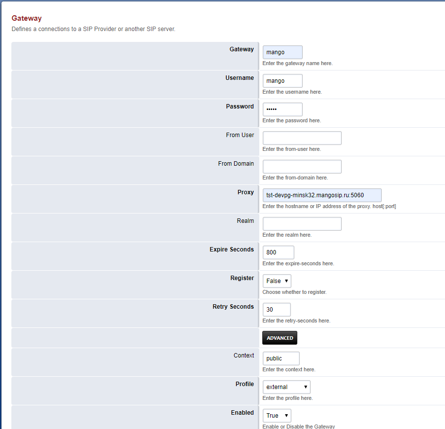

# 7.2. Создание SIP trunk для FusionPBX (Freeswitch)

> Трассировка: PDF §7.2 · сквозные стр. 38-40 · источники: ч.1 `kb/sources/sip-trunk/MO_SIP_Trunk.pdf` с.38-40.

Откройте меню администрирования транков во вкладке Gateways раздела Accounts.

Для добавления нового транка нажмите пиктограмму “+”.

В открывшейся форме необходимо заполнить поля: Gateway – имя транка. В примере используем имя mango.

Username, Password- обязательные поля заполняются любыми значениями Proxy- SIP сервер провайдера Register – выставляем false Context - по умолчанию Public Profile - по умолчанию External Enabled - True Сохраните введенные данные кнопкой Save.

