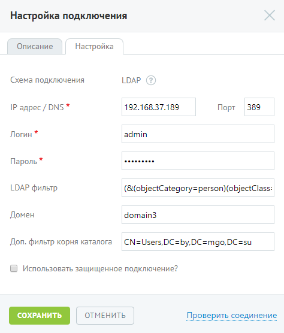

# Шаг 1. Подключение к LDAP-серверу

> Трассировка: PDF §7.5 · сквозные стр. 132-133 · источники: ч.1 `kb/sources/speech-analytics/RECHEVAYA-ANALITIKA_c-KATS_v.1.26.18.pdf` с.132-133.

На данной вкладке осуществляется настройка подключения. При подключении по LDAP следует заполнить набор полей: Речевая аналитика & КАТС | v.1.26.18 132

| 8 800 555 55 22, mango-office.ru |  |
| --- | --- |
|  | mango@mangotele.com |

Поля, отмеченные символом «*», являются обязательными для заполнения. При необходимости использования защищенного подключения следует установить соответствующий флаг и выбрать сертификат. После ввода всех обязательных полей становится доступной кнопка Проверить соединение. При нажатии кнопки выполняется проверка наличия доступа к системе клиента по указанным настройкам. В результате успешного подключения указывается значение «Подключено». Также при успешном подключении на вкладке «Подключение по LDAP» в строке «Статус подключения» отобразится зелёная пиктограмма.

При корректной настройке становится доступным следующий шаг.
