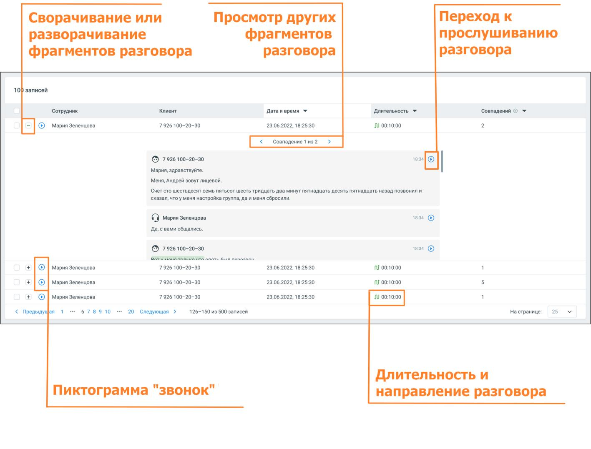

# 2.6.2. Блок результатов

> Трассировка: PDF §2.6.2 · сквозные стр. 39-41 · источники: ч.1 `kb/sources/speech-analytics/RECHEVAYA-ANALITIKA_Skoring_Rukovodstvo-polzovatelya_v.1.26.15.pdf` с.39-41.

Блок содержит подробную информацию о срабатывание триггера, с отображением причины и результата срабатывания.

Блок результатов содержит следующие данные: • Клиент и сотрудник, участники разговора • Длительность и направление разговора • Дата и время разговора Речевая аналитика. Скоринг | v.1.26.15 39

| 8 800 555 55 22, mango-office.ru |  |
| --- | --- |
|  | mango@mangotele.com |

• Количество совпадений с триггером в разговоре. Если в разговоре триггер сработал несколько раз, то для навигации по срабатываниям используйте пиктограммы влево <, и вправо > • Фрагменты разговора, в которых сработал триггер. В каждом фрагменте есть пиктограмма, которая открывает плеер или осциллограмму разговора: o с первой фразы причины триггера (для настроек отображения - Причина и Реакция) o с фразы, где имеется триггер (для настроек отображения - Реакция) Речевая аналитика. Скоринг | v.1.26.15 40

| 8 800 555 55 22, mango-office.ru |  |
| --- | --- |
|  | mango@mangotele.com |
