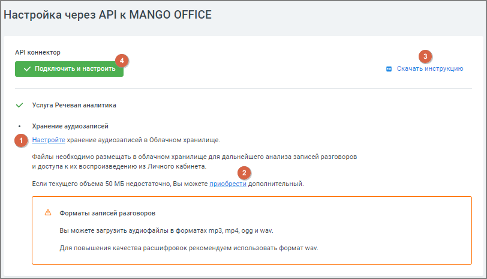

# 4.3. Настройки API

> Трассировка: PDF §4.3 · сквозные стр. 64-65 · источники: ч.1 `kb/sources/speech-analytics/RECHEVAYA-ANALITIKA_Skoring_Rukovodstvo-polzovatelya_v.1.26.15.pdf` с.64-65.

Сервис загрузки по HTTP записей (одноканальных и двухканальных), полученных из офлайн- источников. Основное применение сервиса: получение аудиоданных из мобильного приложения, в котором производится запись звука. Данное API предназначено для получения записей с произвольных клиентских устройств/сервисов/CRM.

| Каждый аудиофайл передается сразу после формирования. Если запись продолжается |
| --- |
| длительное время, клиентское устройство/ПО может для оперативности передачи автоматически |
| разрезаться на фрагменты, не превышающие заданной длины (по умолчанию 5 минут). |
| Вместе с записью передаются следующие данные: |

| • Кто записывал (системный ID пользователя). |
| --- |
| • ID устройства (используется в случае, если для передачи данных используется не |
| мобильное приложение, а конечное устройство, где нет возможности указать учетную запись |
| сотрудника). |
| • Дата/время начала записи. |

| Элементы вкладки: |
| --- |
| 1) Ссылка «Настройте» – клик по ссылке открывает вкладку настроек хранения аудиофайлов. |

Речевая аналитика. Скоринг | v.1.26.15 64

| 8 800 555 55 22, mango-office.ru |  |
| --- | --- |
|  | mango@mangotele.com |

| 2) Ссылка «Приобрести» – клик по ссылке открывает страницу увеличения объема облачного |
| --- |
| хранилища. |
| 3) Кнопка «Скачать инструкцию» – клик по кнопке открывает руководство пользователя API |
| MANGO OFFICE. |
| 4) Кнопка «Подключить и настроить» – клик по кнопке открывает раздел «API коннектор», где |
| можно проверить актуальность настройки. |

В открывшемся окне раздела «API коннектор» заполните поля формы, действуя по инструкции.
