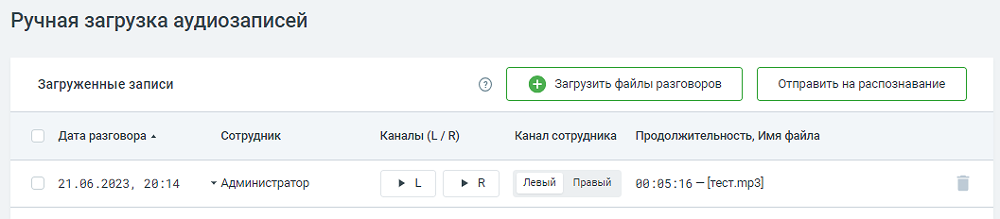
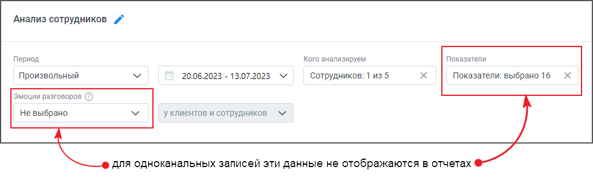

# 4.4. Загрузить вручную

> Трассировка: PDF §4.4 · сквозные стр. 65-67 · источники: ч.1 `kb/sources/speech-analytics/RECHEVAYA-ANALITIKA_Skoring_Rukovodstvo-polzovatelya_v.1.26.15.pdf` с.65-67.

Вкладка предназначена для ручной загрузки в систему аудиозаписей (одноканальных или двухканальных).

Элементы списка: • Дата и время загрузки файла записи; • Сотрудник – пользователю доступен выбор сотрудника, связанного с данным разговором. Это важная настройка! На каждую загрузку необходимо назначить сотрудника, который участвует в разговоре. Без указания сотрудника запись невозможно отправить на распознавание. • Каналы (L /R) – прослушивание записей, отнесенных системой к левому и правому каналам. При прослушивании в наушниках каналы звучат соответственно в левом или правом наушнике. • Продолжительность, Имя файла – отображаются системой автоматически. • Канал сотрудника (левый/правый) – выберите канал сотрудника. совет

| При загрузке одноканальных аудиозаписей система разделяет запись на два канала и |
| --- |
| автоматически проставляет канал сотрудника. Для повышения качества диаризации |
| (разделения каналов) рекомендуется настроить предустановленную техническую тематику со |
| словами-признаками, которые произносит Сотрудник, и по которым система распределит |
| каналы. |

Нажмите на кнопку «Загрузить файлы разговоров» и выберите необходимые аудиозаписи. Возможно загрузить до 20 записей в форматах wav, mp3, mp4, ogg, объемом не более 100 МГб каждый. Для корректной загрузки соблюдайте формат имени файла (см. "Настройки офлайн скоринга"). Пожалуйста, убедитесь, что загружаемые файлы соответствуют следующим ограничениям: • Максимальная длина имени файла 64 символа • Максимальный размер для файлов формата WAV: 100 МБ Речевая аналитика. Скоринг | v.1.26.15 65

| 8 800 555 55 22, mango-office.ru |  |
| --- | --- |
|  | mango@mangotele.com |

• Максимальный размер для сжатых форматов: 30 МБ • Максимальная продолжительность любого файла: 30 минут • Минимальный битрейт: 10 кбит/сек внимание При подключении услуги "Облачное хранилище ВАТС" доступно сохранение звуковых файлов ВАТС, их прослушивание при помощи встроенного плеера, скачивание файлов для дальнейшего использования. В процессе загрузки пользователю отображается прогресс-бар загрузки файлов, а также уведомления об ошибках загрузки (при их наличии). внимание Рекомендуется загружать записи в формате wav. Загрузка записей в форматах mp3, mp4, ogg может привести к погрешности в распознавании разговора или эмоций. Качество аудиозаписи также влияет на точность распознавания. Рекомендуется загружать записи хорошего качества: без шумов, с разборчивой речью и минимальными наложениями голосов. Чем ниже качество аудио, тем менее точной будет текстовая расшифровка. Обратите внимание: система может распознать и низкокачественную запись, но итоговая расшифровка будет соответствующего качества. внимание Если загружены одноканальные аудиозаписи, в отчетах для них не будут отображаться эмоции и показатели разговора.

Система исключает повторные действия по загрузке файлов. Загрузите файл один раз – система автоматически проверит его уникальность, и исключит повторные загрузки. Данные, которые используются для исключения повторных загрузок уже обработанных файлов, хранятся в системе до трех месяцев. Речевая аналитика. Скоринг | v.1.26.15 66

| 8 800 555 55 22, mango-office.ru |  |
| --- | --- |
|  | mango@mangotele.com |
