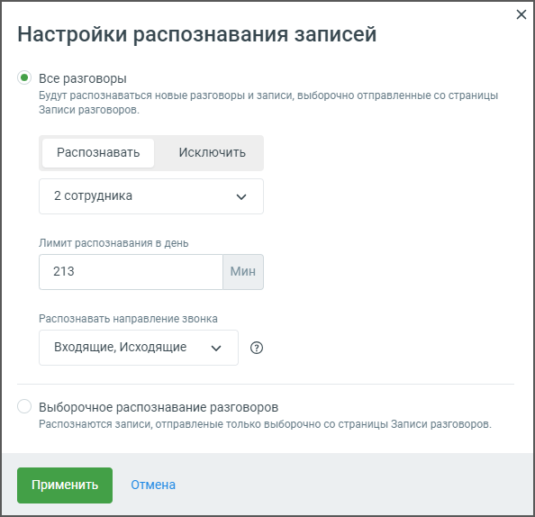

# 7.1.1. Распознавание разговоров

> Трассировка: PDF §7.1.1 · сквозные стр. 81-82 · источники: ч.1 `kb/sources/speech-analytics/RECHEVAYA-ANALITIKA_Skoring_Rukovodstvo-polzovatelya_v.1.26.15.pdf` с.81-82.

Блок Настройка распознавания позволяет настроить функции распознавания и пересылки аудиозаписей разговоров сотрудников. По нажатию на кнопку Настройки открывается окно настроек распознавания записей:

1. Режим распознавания: • Все разговоры – в этом режиме будут распознаваться все новые разговоры и записи, автоматически отправляемые на распознавание со страницы "Записи разговоров". • Выборочное распознавание разговоров – распознаются только те записи, которые вручную отправлены пользователем со страницы "Записи разговоров". 2. Управление сотрудниками – Распознавать/Исключить: • Возможность выбрать сотрудников, чьи разговоры должны распознаваться или исключаться из распознавания. 3. Лимит распознавания в день: Речевая аналитика. Скоринг | v.1.26.15 81

| 8 800 555 55 22, mango-office.ru |  |
| --- | --- |
|  | mango@mangotele.com |

• Вводимое значение ограничивает количество минут разговоров, которые могут быть распознаны за один день. Пользователь может задать минимальное количество для обработки (в примере на скриншоте выбрано 213 минут). 4. Направление звонков для распознавания: Пользователь может выбрать направление звонков, которые будут распознаваться: • Входящие • Исходящие • Внутренние После настройки всех параметров необходимо нажать кнопку Применить для сохранения изменений. Если внесенные изменения не требуются, можно выбрать Отмена, чтобы вернуться к предыдущим настройкам. Эти настройки дают гибкость в управлении процессом распознавания аудиозаписей, позволяют ограничить количество обрабатываемых записей, а также задать удобное расписание для работы системы.
