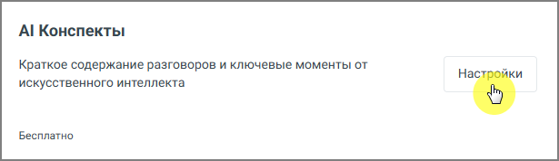
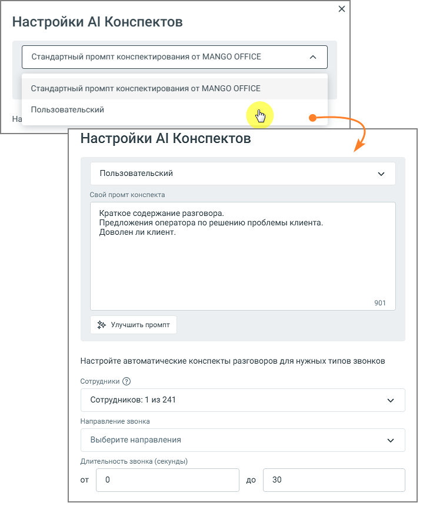

# 7.1.2. AI Конспекты

> Трассировка: PDF §7.1.2 · сквозные стр. 82-84 · источники: ч.1 `kb/sources/speech-analytics/RECHEVAYA-ANALITIKA_Skoring_Rukovodstvo-polzovatelya_v.1.26.15.pdf` с.82-84.

Блок AI Конспекты позволяет автоматически формировать краткое содержание телефонных разговоров с помощью искусственного интеллекта. Это упрощает анализ диалогов и помогает быстро понять суть общения без необходимости прослушивания каждой записи.

Функциональные возможности блока: 1. Автоматическое создание краткого резюме для каждого обработанного звонка — выделение ключевых моментов разговора, включая суть обращения клиента, действия и предложения оператора, а также итог. Резюме отображается рядом с деталями звонка и формируется на основе выбранного промпта. Доступны два варианта: стандартный промпт от MANGO OFFICE или настраиваемый пользовательский промпт до 1000 символов. 2. Обработка разговоров с подключённой речевой аналитикой — AI Конспекты доступны только для звонков, прошедших распознавание. При выборе звонка, который не был расшифрован, запись звонка отправляется на расшифровку и дальнейшее конспектирование. 3. Формирование архивов и выгрузка — возможность экспортировать резюме для внешнего анализа или отчётности. 4. Возможность отключения — если пользователю больше не требуется данная функция, ее можно легко отключить с помощью кнопки Отключить. При включённой функции Пробный период вы можете бесплатно протестировать работу AI Конспектов — до 100 минут обработанных разговоров в сутки. Речевая аналитика. Скоринг | v.1.26.15 82

| 8 800 555 55 22, mango-office.ru |  |
| --- | --- |
|  | mango@mangotele.com |

Настройки AI Конспектов Нажмите кнопку Настройки на плитке AI Конспекты и откройте окно настроек:

Задайте параметры, по которым будет формироваться конспект: • В блоке «Пользовательский» вы можете выбрать стандартный промпт от MANGO OFFICE или создать свой. При выборе «Пользовательский» откроется текстовое поле «Свой промпт Речевая аналитика. Скоринг | v.1.26.15 83

| 8 800 555 55 22, mango-office.ru |  |
| --- | --- |
|  | mango@mangotele.com |

конспекта», где можно ввести собственный шаблон. Ограничение по длине промпта - 1000 символов. Вы всегда можете вернуться к стандартному промпту от MANGO OFFICE, выбрав соответствующую опцию, или отредактировать сохранённый пользовательский промпт. Сохранённый промпт автоматически применяется для конспектирования, запускаемого как из Журнала разговоров, так и из плеера. Все изменения промпта (создание и редактирование) фиксируются в журнале событий для отслеживания. • Сотрудники - выберите конкретных сотрудников, чьи разговоры нужно обрабатывать. Это позволяет исключить технические номера, ботов и т. д. • Направление звонка - уточните, какие звонки нужно обрабатывать: входящие, исходящие, внутренние. Это позволяет ещё точнее ограничить круг анализируемых звонков. • Длительность звонка - задайте минимальную и максимальную длительность звонков (в секундах), для которых будут автоматически создаваться AI-конспекты. Звонки, не попадающие в заданный диапазон, автоматически пропускаются системой. совет

| Используйте кнопку «Улучшить промпт» для получения рекомендаций по оптимизации текста. |
| --- |
| Убедитесь, что ваш промпт чётко определяет желаемые элементы конспекта, такие как краткое |
| содержание, предложения оператора и удовлетворённость клиента. |

После настройки нажмите кнопку Применить, чтобы сохранить параметры.
