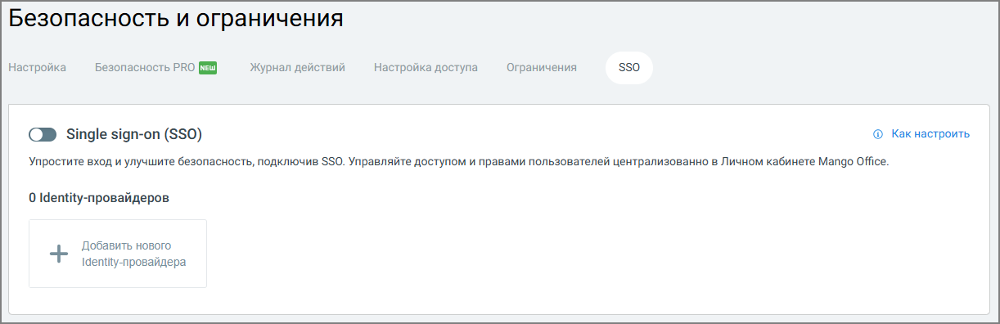

# 7.3.6. SSO (Single Sign-On)

> Трассировка: PDF §7.3.6 · сквозные стр. 98-100 · источники: ч.1 `kb/sources/speech-analytics/RECHEVAYA-ANALITIKA_Skoring_Rukovodstvo-polzovatelya_v.1.26.15.pdf` с.98-100.

Вкладка SSO предназначена для настройки единого входа (Single Sign-On) в Личный кабинет ВАТС и продукты MANGO OFFICE с использованием внешнего identity-провайдера. Использование SSO Речевая аналитика. Скоринг | v.1.26.15 98

| 8 800 555 55 22, mango-office.ru |  |
| --- | --- |
|  | mango@mangotele.com |

позволяет централизованно управлять доступом пользователей и повысить уровень безопасности авторизации.

Для начала работы с SSO необходимо активировать переключатель Single sign-on (SSO). При первом включении отображается окно подтверждения подключения услуги с указанием её стоимости. Для продолжения требуется подтвердить подключение. Включение SSO позволяет пользователям входить в личный кабинет без ввода отдельных логина и пароля MANGO OFFICE, используя корпоративную учётную запись. Identity-провайдеры После подключения услуги администратор может добавить один или несколько identity- провайдеров, через которые будет выполняться авторизация. Для этого используется кнопка Добавить нового Identity-провайдера. Identity-провайдер определяет источник учётных данных пользователей (например, корпоративную систему аутентификации) и правила их проверки при входе. При использовании SSO: • авторизация пользователей выполняется через настроенный identity-провайдер; • управление доступом и правами осуществляется централизованно; • снижается риск использования слабых или скомпрометированных паролей. Подробная пошаговая инструкция по настройке SSO доступна по информационной ссылке «Как настроить», размещённой в верхней правой части вкладки. Рекомендуется использовать данную инструкцию при первичной настройке или изменении параметров identity-провайдера. Речевая аналитика. Скоринг | v.1.26.15 99

| 8 800 555 55 22, mango-office.ru |  |
| --- | --- |
|  | mango@mangotele.com |
