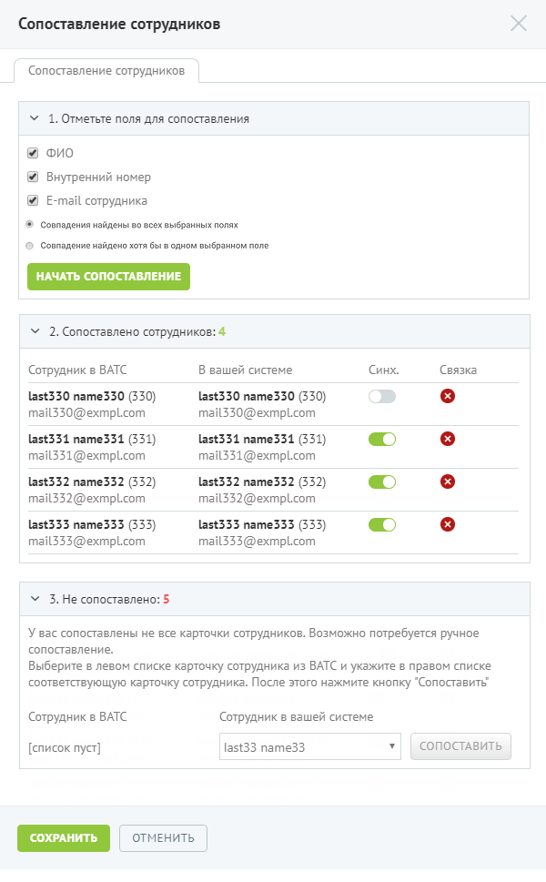
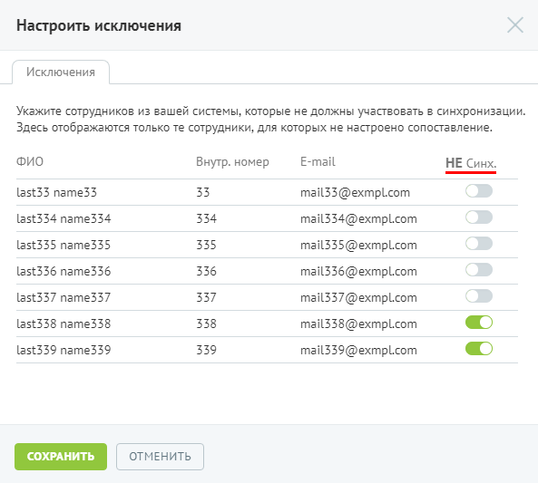

# Шаг 3. Сопоставление сотрудников

> Трассировка: PDF §7.5 · сквозные стр. 104-106 · источники: ч.1 `kb/sources/speech-analytics/RECHEVAYA-ANALITIKA_Skoring_Rukovodstvo-polzovatelya_v.1.26.15.pdf` с.104-106.

Данный шаг не является обязательным. Если в ЛК не создано ни одного пользователя, то его можно пропустить и перейти к шагу 4.

Речевая аналитика. Скоринг | v.1.26.15 104

| 8 800 555 55 22, mango-office.ru |  |
| --- | --- |
|  | mango@mangotele.com |

На первом шаге настройки следует указать, по каким полям будет производиться поиск для сопоставления. Чем больше полей выбрано, тем больше шанс оптимального сопоставления. Помимо выбора полей, доступны также следующие опции сопоставления: • Совпадения найдены во всех выбранных полях (выбрано по умолчанию) - засчитывается только наличие совпадения данных по каждому из выбранных полей. • Совпадение найдено хотя бы в одном выбранном поле – засчитывается наличие совпадения данных хотя бы по одному из выбранных полей. При нажатии кнопки Начать сопоставление начинается автоматический поиск и сопоставление карточек. На втором шаге представлен результат сопоставления карточек сотрудников ЛК и сторонней системы. Предусмотрена возможность остановить синхронизацию карточки и удалить связку. Остановка синхронизации не разрывает связь – в дальнейшем для карточки в ЛК синхронизация выполняться не будет. Третий шаг выполняется при необходимости сопоставления карточек в ручном режиме. Для этого необходимо выбрать сотрудника в ЛК и соответствующего ему сотрудника сторонней системы, после чего нажать Сопоставить. В выпадающих списках сотрудники отсортированы в алфавитном порядке. При подобном сопоставлении, в случае конфликта данных, приоритет будет отдаваться данным из сторонней системы, за исключением случаев пустых строк. Под «конфликтом» понимается ситуация, когда одно поле имеет различные значения в ЛК и сторонней системе. При выполнении синхронизации осуществляется замена данных в ЛК на данные из сторонней системы. Для сохранения изменений нажмите Сохранить. При этом на общей вкладке «Интеграция с LDAP» в разделе «Сопоставление» для параметра «Поиск карточек» отображаются следующие данные:

• Сопоставлено карточек – общее количество сопоставленных карточек; o Синхронизируются – количество сопоставленных карточек с включенной синхронизацией; o Не синхронизируются – количество сопоставленных карточек, синхронизация которых отключена. • Не сопоставлено – общее количество несопоставленных карточек; o В списке исключений – количество карточек сторонней системы, которые исключены из синхронизации; Речевая аналитика. Скоринг | v.1.26.15 105

| 8 800 555 55 22, mango-office.ru |  |
| --- | --- |
|  | mango@mangotele.com |

o Прочее/ошибки – количество карточек, для которых не задана соответствующая карточка в ЛК. Также предусмотрена настройка исключений – список карточек сторонней системы, которые не должны синхронизироваться (например, технические учетные записи). Для настройки списка следует нажать ссылку «Список исключений».

Для того, чтобы отключить синхронизацию несопоставленных сотрудников из сторонней системы, установите переключатель в положение «Включено». Для сохранения настроек нажмите Сохранить.
