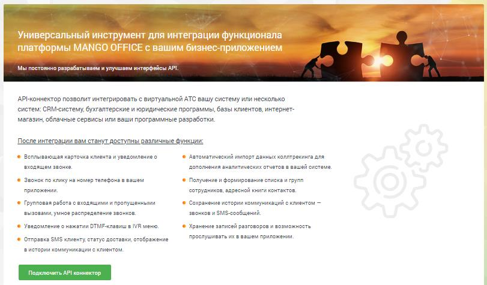
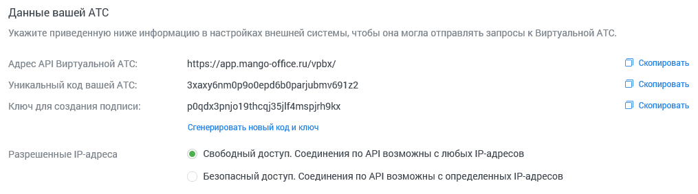
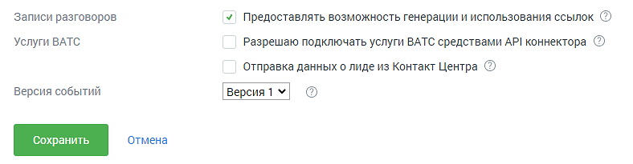
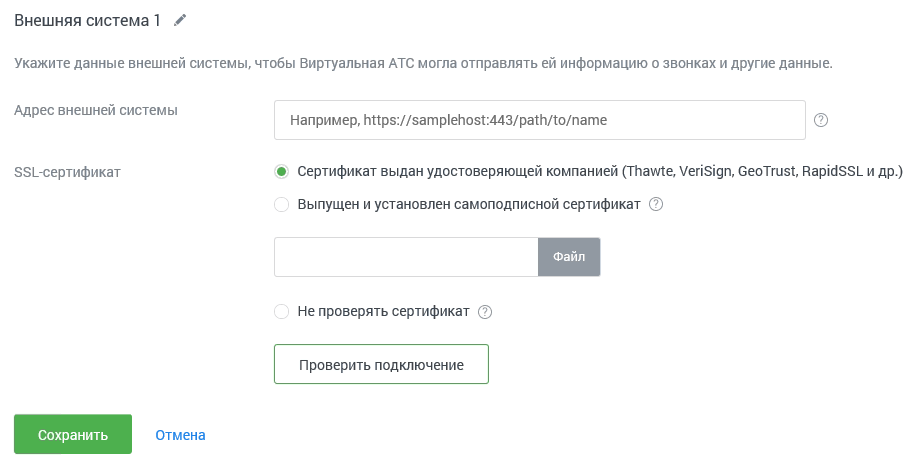
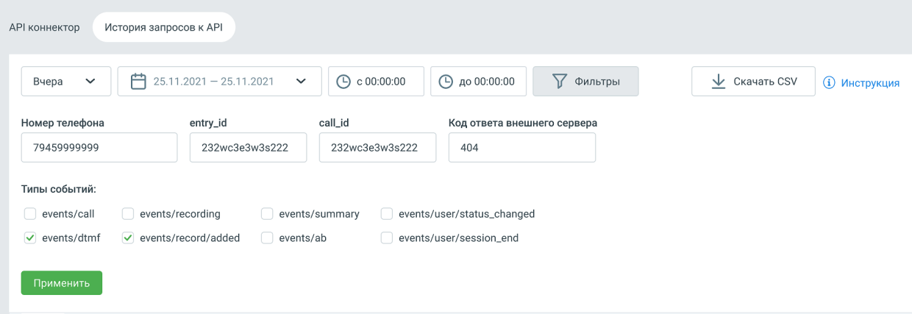
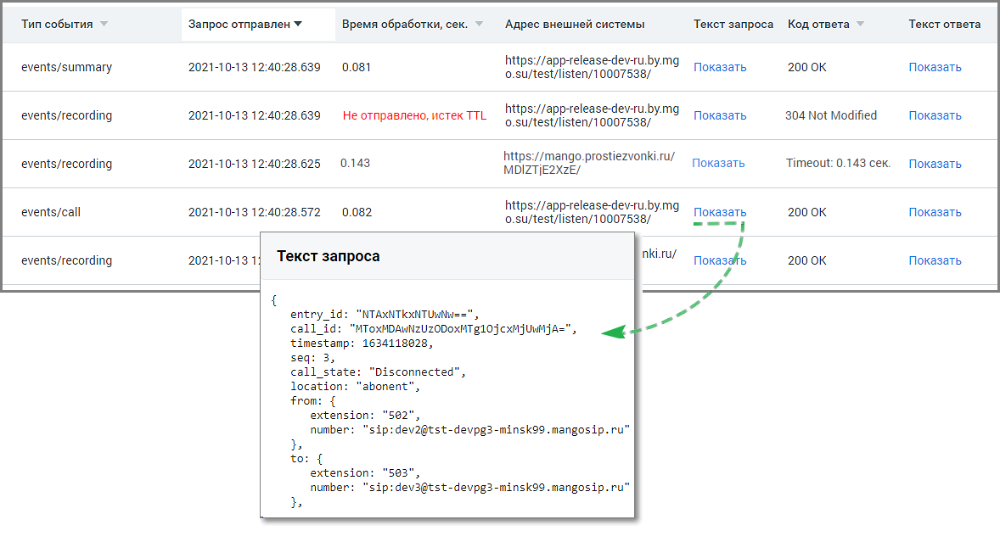

# 7.6. API коннектор

> Трассировка: PDF §7.6 · сквозные стр. 109-114 · источники: ч.1 `kb/sources/speech-analytics/RECHEVAYA-ANALITIKA_Skoring_Rukovodstvo-polzovatelya_v.1.26.15.pdf` с.109-114.

Перейдите на вкладку API Коннектор и нажмите кнопку Подключить API Коннектор.

В открывшемся окне заполните поля формы: Данные вашей АТС В этом блоке приведен пример данных вашего Личного кабинета, которые следует указать в настройках внешней системы. Речевая аналитика. Скоринг | v.1.26.15 109

| 8 800 555 55 22, mango-office.ru |  |
| --- | --- |
|  | mango@mangotele.com |

Уникальный код и ключ для создания подписи генерируются автоматически. При необходимости вы можете сгенерировать новые код и ключ, нажав соответствующую кнопку. После изменения данных следует обновить настройки внешней системы, подключенной по API. При настройке IP-адресов, которым разрешен доступ по API, мы рекомендуем использовать безопасный доступ с указанием так называемых «белых» IP-адресов. Для этого установите переключатель в соответствующее положение и составьте список IP-адресов, с которых будет разрешен доступ.

Дополнительные параметры API

При включенной настройке «Записи разговоров» внешней системе предоставляется возможность генерации и использования прямых ссылок для скачивания и воспроизведения записи разговоров. При включенной настройке «Услуги ЛК» при вызовах методов API подключаются соответствующие услуги (к примеру, алгоритм дозвона), если они входят в текущий тарифный план. В журнале действий в ЛК работа с услугами (в том числе сотрудниками, группами) через API отображается от имени виртуального пользователя «API конструктор». При включенной настройке «Отправка данных о лиде из Контакт Центра» внешней системе передаются данные лидов из Контакт Центра MANGO OFFICE. Внимание При включенной настройке записи доступны без авторизации в Личном кабинете, что может привести к несанкционированному скачиванию записей. Данные внешней системы Выберите имя внешней системы. В поле для ввода адреса внешней системы указывается адрес внешней системы в виде имени сервера, порта и url-пути. В качестве имени сервера можно использовать как доменное имя, так и IP-адрес. Речевая аналитика. Скоринг | v.1.26.15 110

| 8 800 555 55 22, mango-office.ru |  |
| --- | --- |
|  | mango@mangotele.com |

Укажите тип SSL-сертификата. Если вы используете самоподписной сертификат, то установите переключатель в соответствующее положение и при помощи кнопки «Обзор» укажите путь к корневому файлу сертификата. Впоследствии загруженный сертификат можно заменить или удалить.

Внимание При выборе варианта «Не проверять сертификат» проверка подлинности соединения внешней системы с Виртуальной ЛК не выполняется. Существует угроза безопасности данных. При наличии подключенной услуги с установленным ограничением (>1) отображается кнопка Добавить систему для добавления дополнительных внешних систем. При нажатии кнопки добавляется блок «Данные внешней системы» с аналогичным набором полей. Внимание При подключении нескольких внешних систем рассылка осуществляется последовательно на каждый из адресов, согласно настройкам Личного кабинета. Настройка IP-адресов осуществляется для всех внешних систем одновременно. Совет

| При использовании групповых IP-адресов вы можете избежать необходимости ввода каждого |
| --- |
| отдельного адреса, применяя символы «*» и «-». Их назначение и примеры использования |
| приведены в справке, вызываемой при наведении курсора на значок |

Ограничения и фильтры на отправку данных по событиям API Настроить отправку событий по разговорам – если чекбокс отмечен, доступны три дополнительных настройки: o Не отправлять уведомления о промежуточном состоянии вызова и его параметрах (событие events/call) - если включен, во внешнюю систему не отправляются данные из API по этапам совершения разговора; Речевая аналитика. Скоринг | v.1.26.15 111

| 8 800 555 55 22, mango-office.ru |  |
| --- | --- |
|  | mango@mangotele.com |

o Не отправлять уведомления с итоговой информацией по разговору (событие events/summary) – если включен, во внешнюю систему не отправляются данные из API с информацией о разговоре; o Исключить отправку событий для номеров (выбрать) – разговоровые события API не отправляются во внешнюю систему, если в них участвуют выбранные номера. Не пробрасывать идентификатор SIP_Call_ID из внешней системы – если чекбокс отмечен, то в разговоровых событиях API не передается идентификатор SIP_Call_ID, полученный от внешней системы при входящих разговорах. Не отправлять уведомления о нажатиях DTMF-клавиш клиентом в IVR (событие events/dtmf) – если чекбокс отмечен, то во внешнюю систему не передаются данные о нажатиях клиентом клавиш в меню IVR в тональном режиме. Не отправлять уведомления о состоянии записи разговоров (событие events/recording) – если чекбокс отмечен, то во внешнюю систему не передаются данные о каждом новом состоянии записи разговора. Не отправлять события о готовности для скачивания файла записи разговора (событие events/record/added) – если чекбокс отмечен, то во внешнюю систему не передаются данные о возможности скачать файл записи разговора. Не отправлять информацию о статусе доставки SMS-сообщений (событие events/sms) – если чекбокс отмечен, то во внешнюю систему не передаются данные о доставке СМС клиенту. Не отправлять информацию о событиях в Адресной книге на указанный адрес внешней системы (события events/ab) – если чекбокс отмечен, сервис API не информирует внешнюю систему об изменениях в адресной книге MANGO OFFICE. Не отправлять события о завершении процесса распознавания тематик в телефонных разговорах (событие events/record/tagged) – если чекбокс отмечен, сервис API не информирует о завершении процесса распознавания тематик разговора.

После ввода всех данных нажмите кнопку «Проверить подключение». Если все поля заполнены корректно, то запускается процедура проверки соединения Виртуальной АТС и внешней системы по API. Если поля заполнены неправильно, на экране отобразится подробное сообщение, указывающее на ошибку. Аналогичная проверка выполняется при нажатии на кнопку «Сохранить». Сохранение данных выполняется только в том случае, когда все данные указаны правильно и соединение установлено. Речевая аналитика. Скоринг | v.1.26.15 112

| 8 800 555 55 22, mango-office.ru |  |
| --- | --- |
|  | mango@mangotele.com |

Вкладка История запросов к API Вкладка содержит набор фильтров для поиска запросов к API и событий для клиента.

Для отбора данных доступны фильтры: Период – варианты выпадающего списка: последний час, сегодня, вчера, последние три дня, текущая неделя, текущий месяц, произвольный период. Доступны данные за период не более двух месяцев. Время – выбор времени осуществления запроса. По клику на кнопку «Фильтры» отображаются поля дополнительной фильтрации: Номер телефона – фильтрует данные по номеру телефона, в том числе по частичному совпадению строки с введёнными данными. entry_id – фильтрует данные по параметру entry_id в API ЛК, в том числе по частичному совпадению строки идентификатора с введёнными данными. call_id – фильтрует данные по параметру call_id в API ЛК, в том числе по частичному совпадению строки идентификатора с введёнными данными. Код ответа внешней системы – фильтрует данные по числовому коду ответа сервера внешней системы. Допускается только ввод цифр, не более 3 знаков. Чекбоксы Типы событий – events/call, events/summary, events/dtmf, events/recording, events/record/added, events/record/tagged, events/sms, events/ab, events/user/status_changed, events/user/session_end. Клик по кнопке «Скачать CSV» открывает стандартное окно экспорта таблицы детализации в формате CSV (Excel). Клик по кнопке «Применить» открывает окно выдачи с применением всех выбранных на странице фильтров. Речевая аналитика. Скоринг | v.1.26.15 113

| 8 800 555 55 22, mango-office.ru |  |
| --- | --- |
|  | mango@mangotele.com |

Окно выдачи содержит:

Тип события – список событий в соответствии с выбранными в фильтрах чекбоксами. Запрос отправлен – дата и время отправки запроса от API ЛК клиенту. Время обработки – время обработки запроса от API ЛК сервером клиента. Адрес внешней системы – адрес внешней системы, на который API отправляет событие. Текст запроса – клик на кнопку «Показать» открывает окно с полным текстом POST-запроса со стороны API к внешней системе. Код ответа – содержит код ответа сервера клиента на http-запрос от API ЛК с расшифровкой. Например: "200 OK", "404 Not Found", "405 Method Not Allowed". Текст ответа – клик на кнопку «Показать» открывает окно с полным текстом ответа на POST-запрос от API ЛК. Предусмотрен экспорт файла истории в формате CSV. После клика на кнопку «Скачать CSV» будет открыто стандартное диалоговое окно браузера, позволяющее сохранить файл.
