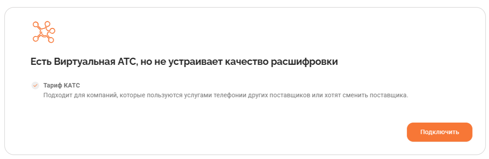

# 1.1. Подключение услуги «Речевая аналитика»

> Трассировка: PDF §1.1 · сквозные стр. 6-7 · источники: ч.1 `kb/sources/speech-analytics/RECHEVAYA-ANALITIKA_c-KATS_v.1.26.18.pdf` с.6-7.

аналитика» Для подключения услуги Речевая аналитика на странице подключения РА ознакомьтесь с тарифом «КАТС», нажмите кнопку Подключить и в открывшейся форме заполните свои контактные данные.

Дождитесь системного уведомления «Ваша заявка принята» и звонка персонального менеджера, который должен активировать продукт «Речевая аналитика, тариф КАТС». После активации тарифа на боковой навигационной панели вам будет доступно меню MANGO OFFICE «Речевая аналитика & КАТС». Речевая аналитика & КАТС | v.1.26.18 6

| 8 800 555 55 22, mango-office.ru |  |
| --- | --- |
|  | mango@mangotele.com |
