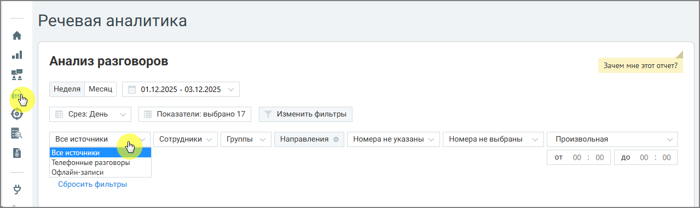

# 2.3.1. Как настраивается отчет “Анализ разговоров”

> Трассировка: PDF §2.3.1 · сквозные стр. 22-23 · источники: ч.1 `kb/sources/speech-analytics/RECHEVAYA-ANALITIKA_c-KATS_v.1.26.18.pdf` с.22-23.

разговоров” Для построения отчета “Анализ разговоров” выберите временной период, срез (день/месяц/год) и показатели, по которым будет формироваться отчет.

О показателях, по которым осуществляется формирование отчета, подробнее здесь.

| Если нажать кнопку «Отменить» или иконку , изменения не будут внесены, а выборка |
| --- |
| показателей вернется к последней сохраненной версии. |

По завершению работы указанных выше фильтров отчет будет сформирован автоматически. Для дополнительной фильтрации данных в отчете откройте выпадающий список Изменить фильтры. Источники записи – выбор из настроенных в Личном кабинете источников записей разговоров. Сотрудники – при установке флага напротив имени сотрудника в результате применения фильтра отчет будет включать только выбранных сотрудников. Для быстрого выбора всех сотрудников предусмотрен общий флаг. Группы – при установке флага напротив наименования группы сформированный отчет будет включать только выбранные группы. Для быстрого выбора всех групп предусмотрен общий флаг. Направления – направление разговора: входящие, исходящие, внутренние. Речевая аналитика & КАТС | v.1.26.18 22

| 8 800 555 55 22, mango-office.ru |  |
| --- | --- |
|  | mango@mangotele.com |

Длительность – продолжительность разговора. По умолчанию установлен параметр «произвольная длительность».

Номера клиента – номера телефонов клиентов, разговоры с которыми необходимо учитывать при построении отчета. Номера ВАТС – выбор номеров линии ВАТС (максимальное количество - 100); Внутри фильтра действует принцип фильтрации – ИЛИ (когда одно из условий истинно). Между фильтрами действует принцип фильтрации – И (когда все условия истинны). Кнопкой Выбрать сохраните внесенные изменения.
