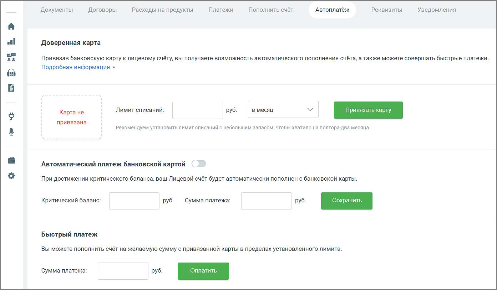

# 6.6. Автоплатеж

> Трассировка: PDF §6.6 · сквозные стр. 98-100 · источники: ч.1 `kb/sources/speech-analytics/RECHEVAYA-ANALITIKA_c-KATS_v.1.26.18.pdf` с.98-100.

Внимание Раздел доступен только для пользователей с ролью «Администратор лицевого счета». Привязка банковской карты позволит настроить автоматическое пополнение платежа в соответствии с указанным лимитом, или совершить быстрый платеж. Речевая аналитика & КАТС | v.1.26.18 98

| 8 800 555 55 22, mango-office.ru |  |
| --- | --- |
|  | mango@mangotele.com |

Внимание Сервисы по оплате и подтверждению доверенности на совершение автоматических платежей предоставляются системой электронных платежей компании PayMaster. Компания «Манго-Офис» (www.mango-office.ru) не получает персональные и банковские данные клиента. Доверенная карта Для привязки банковской карты установите лимит, минимально допустимое значение – 100 рублей. Затем выберите период и нажмите кнопку Привязать карту. В результате будет выполнена переадресация на соответствующую страницу сайта компании PayMaster для указания необходимых данных. После того, как вы указали все данные, осуществляется возврат на страницу Личного кабинета с указанием полученной информации.

В строке «Лимит обновится» указывается дата и время перехода в новый лимитный период. Чтобы отвязать банковскую карту, нажмите кнопку «Отвязать карту». Карта будет отвязана после нажатия кнопки без дополнительных предупреждений. Автоматический платеж банковской картой Данная настройка позволяет указать величину критического баланса, при достижении которого будет автоматически внесен платеж в указанном размере в рамках лимита списаний. Для включения функции установите переключатель в положение «Сервис включен». Укажите критический баланс и размер платежа. Сохраните указанные данные. Речевая аналитика & КАТС | v.1.26.18 99

| 8 800 555 55 22, mango-office.ru |  |
| --- | --- |
|  | mango@mangotele.com |

Внимание Запрещено указывать сумму платежа, превышающую лимит списаний. Если в момент достижения критического баланса сумма автоматического платежа превысит сумму доступных средств, то платеж не будет выполнен. Для своевременного информирования о достижении критического баланса рекомендуем настроить соответствующие уведомления. Быстрый платеж Данная функция позволяет самостоятельно внести платеж на произвольную сумму в рамках доступного лимита средств без необходимости ввода данных банковской карты. Укажите сумму платежа. Минимальная сумма – 100 рублей. Нажмите кнопку Сохранить. Внимание Если сумма платежа превысит остаток доступных средств, то платеж не будет совершен. Вам будет предложено выполнить обычный платеж со вводом всех данных банковской карты на сайте компании PayMaster.
