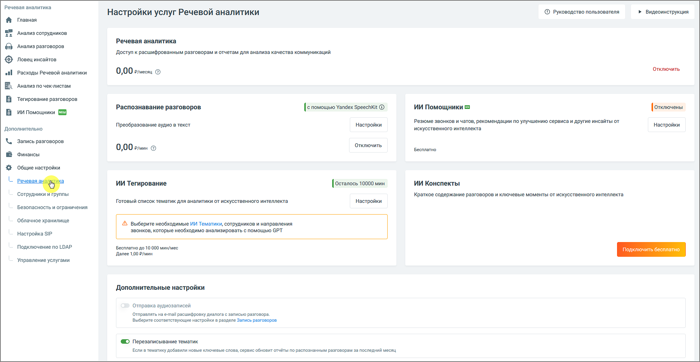

# 7.1. Речевая аналитика

> Трассировка: PDF §7.1 · сквозные стр. 103-104 · источники: ч.1 `kb/sources/speech-analytics/RECHEVAYA-ANALITIKA_c-KATS_v.1.26.18.pdf` с.103-104.

Вкладка Речевая аналитика содержит следующие блоки:

Услуга «Речевая аналитика» – отображается абонентская плата за услугу. Распознавание разговоров – отображается стоимость расшифровки и распознавания аудиозаписей разговоров. В настройках можно настроить условия распознавания аудиозаписей разговоров. Пользователь может отправлять на распознавание только нужные звонки. ИИ-инструменты 1. ИИ Помощники – инструмент для автоматического анализа диалогов по заданным правилам, который выдаёт не только краткое содержание, но также полезные выводы и рекомендации. 2. ИИ Конспекты – данная услуга Речевой Аналитики позволяет автоматически формировать краткое содержание диалога и выделять ключевые моменты с помощью искусственного интеллекта. 3. ИИ Тегирование – услуга предоставляет возможность смыслового анализа разговоров на основе запросов к ИИ без подбора ключевых слов. Анализ разговоров с использованием ИИ-запросов доступен только при активированных услугах «Абонентская плата» и «Распознавание разговоров». Элементы настроек услуги: • Сотрудники: Выбор диапазона сотрудников для анализа. Пользователь может выбрать конкретных сотрудников для фильтрации разговоров. Необходимо убедиться, что выбранные для анализа сотрудники совпадают с теми, кто уже выбран для распознавания разговоров. • Направление звонка: Позволяет выбрать направление (входящие, исходящие или внутренние звонки) по которому разговоры будут фильтроваться для отправки на тегирование. Речевая аналитика & КАТС | v.1.26.18 103

| 8 800 555 55 22, mango-office.ru |  |
| --- | --- |
|  | mango@mangotele.com |

внимание Стоимость услуги определяется на основе продолжительности анализируемых разговоров, а списание средств происходит каждую ночь.
