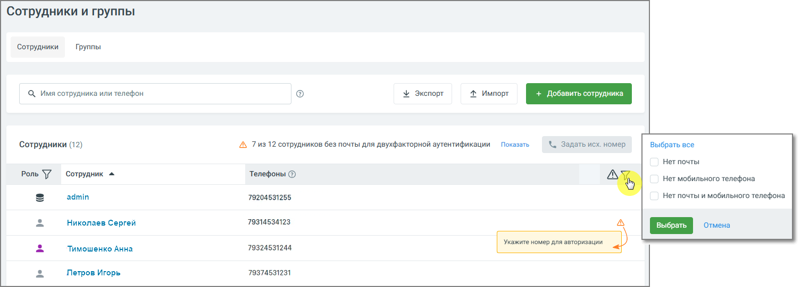
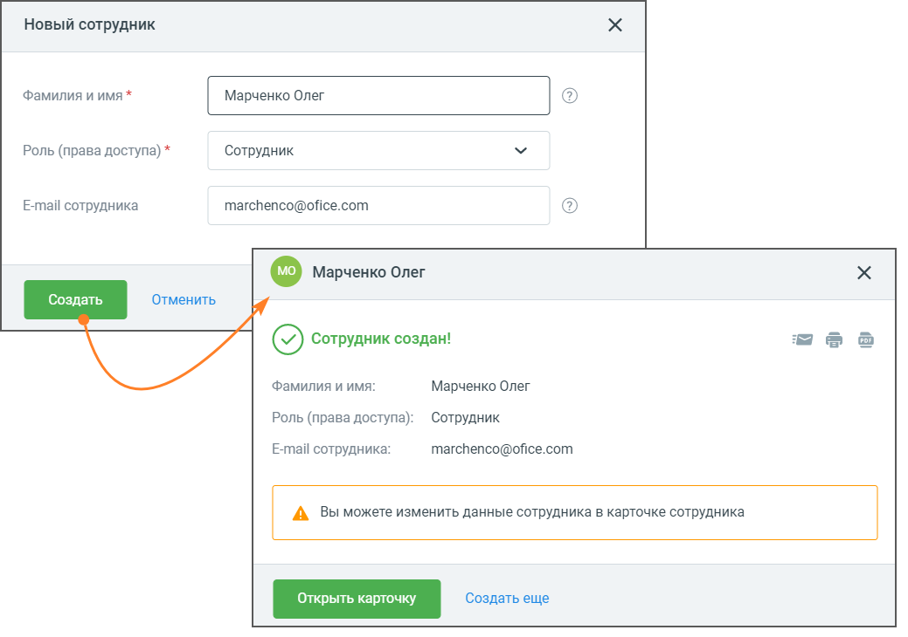
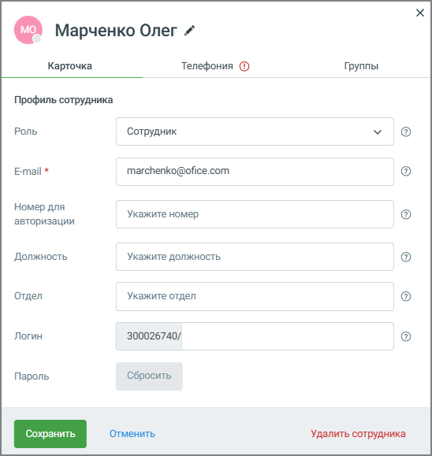
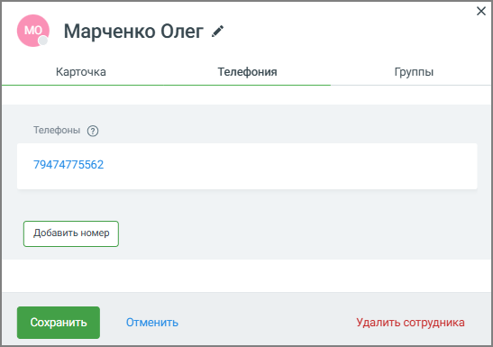

# 7.2.1. Вкладка «Сотрудники»

> Трассировка: PDF §7.2.1 · сквозные стр. 117-120 · источники: ч.1 `kb/sources/speech-analytics/RECHEVAYA-ANALITIKA_c-KATS_v.1.26.18.pdf` с.117-120.

На вкладке содержится список сотрудников, добавленных в Личном кабинете РА.

Речевая аналитика & КАТС | v.1.26.18 117

| 8 800 555 55 22, mango-office.ru |  |
| --- | --- |
|  | mango@mangotele.com |

На вкладке доступна следующая информация: • Просмотр списка сотрудников – позволяет видеть всех пользователей, подключённых к системе, вместе с их ролями и контактными данными. • Поиск сотрудников – помогает быстро найти сотрудника по имени или номеру телефона. • Экспорт – сохраняет текущий список сотрудников в файл для дальнейшего использования или архивирования. • Импорт – загружает сотрудников из файла, что удобно при массовом добавлении. • Фильтрация по отсутствующим данным – позволяет выбрать сотрудников без e-mail, без мобильного телефона или без обоих параметров. • Массовый выбор сотрудников – выделяет сотрудников, соответствующих выбранным критериям, для дальнейшего редактирования. • Редактирование данных сотрудника – при клике по имени сотрудника открывается карточка с его настройками, где можно изменить контактные данные и параметры доступа. Иконки предупреждений – показывают сотрудников без e-mail или мобильного телефона, необходимых для двухфакторной аутентификации, и другую информацию. Добавление сотрудника Клик по кнопке «Добавить сотрудника» открывает форму добавления сотрудника. Заполните поля формы и сохраните произведенные изменения.

В информационном окне «Сотрудник создан!» вы можете открыть и заполнить карточку сотрудника. Речевая аналитика & КАТС | v.1.26.18 118

| 8 800 555 55 22, mango-office.ru |  |
| --- | --- |
|  | mango@mangotele.com |

Во вкладке Телефония можно добавить или удалить номера телефонов сотрудников. Эти номера используются для определения Сотрудника, участвующего в разговоре.

Добавьте сотрудника в одну из групп. Для этого на вкладке Группы необходимо предварительно создать одну или несколько групп. Также имеется возможность удалить Сотрудника и изменить его ФИО. Речевая аналитика & КАТС | v.1.26.18 119

| 8 800 555 55 22, mango-office.ru |  |
| --- | --- |
|  | mango@mangotele.com |
