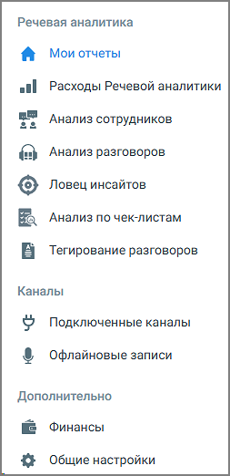

# 1. Общие сведения

> Трассировка: PDF §1 · сквозные стр. 5-7 · источники: ч.1 `kb/sources/speech-analytics/RECHEVAYA-ANALITIKA_Skoring_Rukovodstvo-polzovatelya_v.1.26.15.pdf` с.5-7.

MANGO OFFICE предоставляет пользователям возможность использовать Речевую аналитику совместно с офлайн скорингом. При помощи модуля Речевая аналитика «Офлайн-скоринг» руководитель может анализировать офлайн коммуникации сотрудников: торговых представителей, выездных менеджеров, консультантов, промоперсонала и т.д. Речевая аналитика «Офлайн-скоринг» распознает загруженные в файловое хранилище разговоры, и производит поиск – вручную или автоматически – необходимой информации в разговоре. Как работает поиск по распознанным записям разговоров, читайте здесь. После подключения услуги Речевая аналитика «Офлайн-скоринг» пользователю доступны следующие функции: • Поиск в распознанных записях разговоров заданных слов и выражений • Автоматическое проставление тематики разговору • Текстовая расшифровка разговора • Составление отчетов • Получение уведомлений Чтобы эффективно использовать возможности модуля пользователю необходимо: Подключить каналы получения аудиозаписей или загрузить записи вручную Добавить сотрудников в Личный кабинет Настроить тематики Речевой аналитики Сформировать и проанализировать отчеты Речевой аналитики Офлайн-скоринг – это сервис Речевой аналитики, работающий на звуковых записях/метаданных, поступающих из офлайновых источников. В качестве таковых могут выступать произвольные FTP/FTPS серверы, звукозаписывающие устройства или записи, загруженные на сервис вручную. Личный кабинет пользователя Речевой аналитики «Офлайн-скоринг» содержит три основных раздела: • Речевая аналитика • Каналы • Дополнительно Речевая аналитика. Скоринг | v.1.26.15 5

| 8 800 555 55 22, mango-office.ru |  |
| --- | --- |
|  | mango@mangotele.com |

Ознакомьтесь с дизайном Личного кабинета и переходите к настройке каналов. Речевая аналитика. Скоринг | v.1.26.15 6

| 8 800 555 55 22, mango-office.ru |  |
| --- | --- |
|  | mango@mangotele.com |
