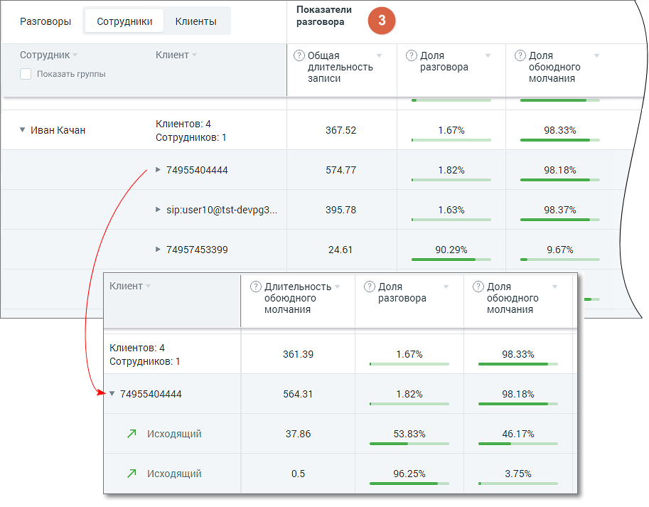

# 2.2.3. Блок таблицы Разговоры, детализация

> Трассировка: PDF §2.2.3 · сквозные стр. 13-16 · источники: ч.1 `kb/sources/speech-analytics/RECHEVAYA-ANALITIKA_Skoring_Rukovodstvo-polzovatelya_v.1.26.15.pdf` с.13-16.

детализация Табличная часть отчета состоит из трех разделов: • Разговоры • Тематики • Показатели разговора Раздел «Разговоры, детализация» Детализация разговоров предоставляется в срезах Сотрудники/Клиенты. В таблице отчета данные выводятся с возможностью группировки согласно установленных фильтров.

Таблица содержит следующие столбцы (рассмотрим пример для среза «Сотрудники»): • Сотрудник – имя сотрудника ЛК. • Клиент – количество уникальных клиентов (не привязанных ни к одному из сотрудников ЛК) с которыми у выбранного сотрудника за выбранный период состоялся успешный разговор. По каждому клиенту доступна детализация с записями разговоров. Если при загрузке файлов не бы указан номер телефона клиента он будет отбражаться как офлайн-клиент, если указан то название будет ссответвующее названию файла. • Дата – диапазон дат в которые у выбранного сотрудника имеются распознанные разговоры. • Разговор – суммарное количество распознанных разговоров выбранного сотрудника за выбранный период. Речевая аналитика. Скоринг | v.1.26.15 13

| 8 800 555 55 22, mango-office.ru |  |
| --- | --- |
|  | mango@mangotele.com |

• Длительность – суммарная длительность всех распознанных разговоров выбранного сотрудника за выбранный период в формате ЧЧ:ММ:СС. • Эмоции клиента – среднее значение, отображается смайлом. • Эмоции сотрудника – среднее значение, отображается смайлом.

По клику на пиктограмму открывается окно записи разговора с расшифровкой. Если чекбокс «Показать группы» проставлен, столбец Сотрудник содержит двухуровневый иерархический список (группа / сотрудник): т.е. сотрудники сгруппированы по группам. Данные в отчете в этом случае формируются и для группы в целом. Раздел «Тематики»

В развернутом виде раздел таблицы содержит следующие столбцы: • Срабатывание тематик – показатель вида (N из M), где N – количество соответствующих данному разговору тематик, а M – общее количество тематик, выбранных в блоке фильтрации. • Столбцы с наименованиями тематик – все тематики, выбранные в блоке фильтрации, с пометкой о срабатывании. В детализации разговоров пометка о срабатывании отображается по каждому разговору. При расчете данных в столбцах используются следующие величины: • N – количество соответствующих разговору тематик • M – общее количество тематик, выбранных в блоке фильтрации

– параметр, равный N/M*100%;

– параметр, равный среднему арифметическому данных в строке по всем выбранным тематиким; Речевая аналитика. Скоринг | v.1.26.15 14

| 8 800 555 55 22, mango-office.ru |  |
| --- | --- |
|  | mango@mangotele.com |

– параметр, равный отношению количества меток "Сработал" (по вертикали) к общему количеству меток ("Сработал " + "Не сработал ") Раздел «Показатели разговора»

Раздел таблицы содержит следующие столбцы: • Общая длительность записи • Длительность разговора • Длительность обоюдного молчания • Доля разговора • Доля обоюдного молчания • Количество перебиваний сотрудником • Количество перебиваний клиентом • Доля обоюдного разговора • Доля разговора сотрудника • Доля разговора клиента • Скорость разговора сотрудника • Скорость разговора клиента Речевая аналитика. Скоринг | v.1.26.15 15

| 8 800 555 55 22, mango-office.ru |  |
| --- | --- |
|  | mango@mangotele.com |

Чтобы узнать правило расчета каждого из показателей, наведите курсор на пиктограмму «?» возле наименования показателя. Подробнее о значениях показателей узнайте здесь. Для фильтрации данных отчета по возрастанию/убыванию следует щелкнуть по наименованию столбца.

Для выгрузки данных отчета в формате CSV кликните на пиктограмму в правом верхнем углу табличной части. Доступны выгрузка файла отчета по сотрудникам и по клиентам.
