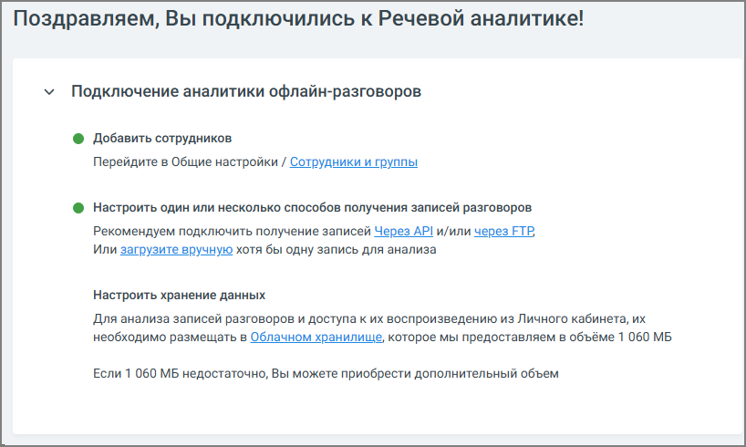

# 4.1. Основные настройки

> Трассировка: PDF §4.1 · сквозные стр. 60 · источники: ч.1 `kb/sources/speech-analytics/RECHEVAYA-ANALITIKA_Skoring_Rukovodstvo-polzovatelya_v.1.26.15.pdf` с.60.

В разделе Основные настройки пользователь может ознакомится со статусом подключения услуги.

По мере настройки опции изменяется ее индикатор.

— опция настроена

— опция не настроена
