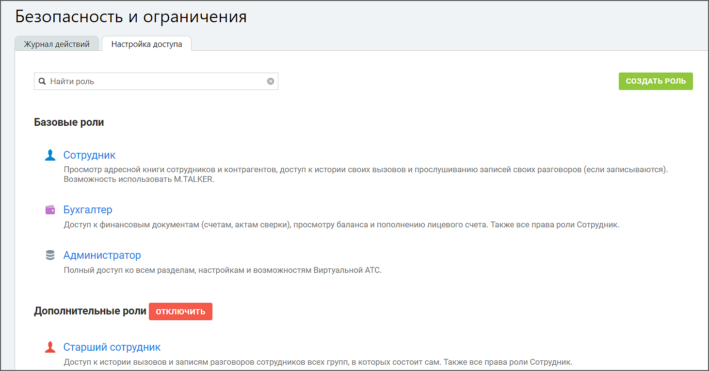
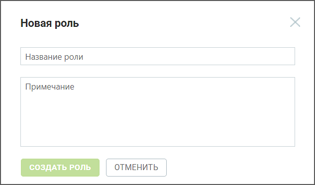
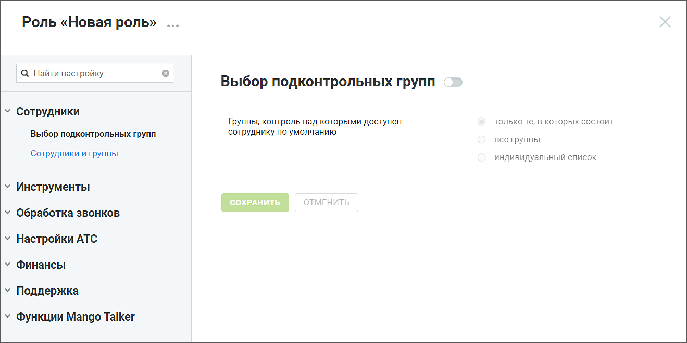
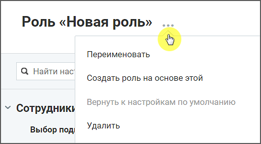
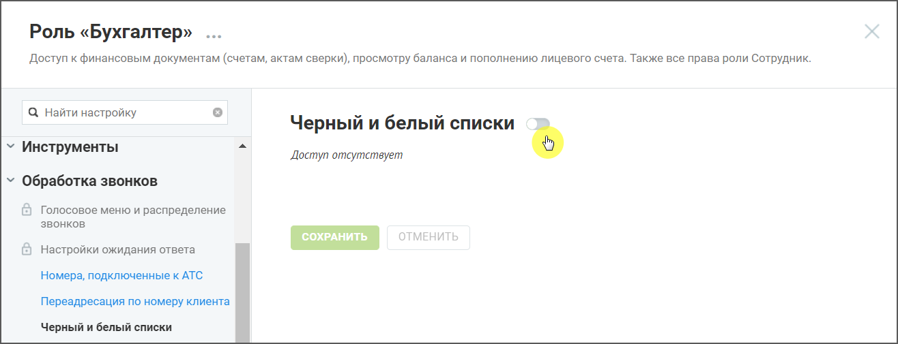

# 7.3.4. Вкладка «Настройки доступа»

> Трассировка: PDF §7.3.4 · сквозные стр. 96-98 · источники: ч.1 `kb/sources/speech-analytics/RECHEVAYA-ANALITIKA_Skoring_Rukovodstvo-polzovatelya_v.1.26.15.pdf` с.96-98.

Данный раздел предназначен для создания и редактирования ролей пользователей.

Предусмотрен базовый, дополнительный и пользовательские наборы ролей. Базовый набор доступен по умолчанию и включает следующие роли: Сотрудник, Бухгалтер и Администратор. Для подключения пакета дополнительных ролей следует нажать на кнопку Подключить. В результате становится доступным набор соответствующим образом настроенных ролей для разных типов пользователей, а также возможность создания и настройки собственных пользовательских ролей. внимание При отключении дополнительного пакета выполняется удаление всех созданных пользовательских ролей. В случае, когда удаленные роли ранее были назначены сотрудникам, их роль автоматически меняется на «Сотрудник». Для создания роли следует нажать на кнопку Создать роль. В открывшейся форме следует указать наименование роли и текстовое описание доступного функционала.

Для редактирования настроек роли следует щелкнуть по наименованию роли. Речевая аналитика. Скоринг | v.1.26.15 96

| 8 800 555 55 22, mango-office.ru |  |
| --- | --- |
|  | mango@mangotele.com |

Для переименования роли и других операций с текущей ролью следует щелкнуть по пиктограмме «…» в заголовке роли. Меню роли содержит следующие пункты:

В левой части основной формы содержится список разделов Личного кабинета. Для настройки доступа следует нажать на название раздела. При этом в правой части формы отображается набор соответствующих настроек.

Напротив наименования раздела в правой части формы расположен переключатель доступности раздела. Во включенном состоянии пользователь получает доступ ко всем настройкам внутри раздела, если они имеются. В отключенном состоянии все настройки внутри раздела отключаются, доступ к соответствующему разделу Личного кабинета закрыт. Речевая аналитика. Скоринг | v.1.26.15 97

| 8 800 555 55 22, mango-office.ru |  |
| --- | --- |
|  | mango@mangotele.com |

Также при снятии последнего флага внутри раздела (при его наличии), переключатель автоматически переводится в положение «Отключен», доступ к разделу Личного кабинета в результате закрыт. После завершения редактирования настроек необходимо нажать кнопку Сохранить. Без выполнения этого действия при переходе к другому разделу внесенные изменения не сохраняются. Настройка доступа к персональным контактам В разделе Безопасность и ограничения → [выбрать роль] → Инструменты → Адресная книга доступна настройка «Коммуникация с персональными контактами (возможность позвонить и написать на персональный контакт)». Пользователь, ограниченные этой настройкой, не смогут совершать вызовы на скрытые номера, а также видеть телефон клиента, если за ним закреплён другой пользователь. Это исключает несанкционированный доступ к базе персональных контактов. Данная функциональность снижает риск утечки персональных данных и защищает клиентскую базу от возможного несанкционированного использования. Компании получают дополнительный уровень безопасности, сохраняя конфиденциальность информации и уменьшая вероятность финансовых убытков, связанных с неправомерным раскрытием данных.
