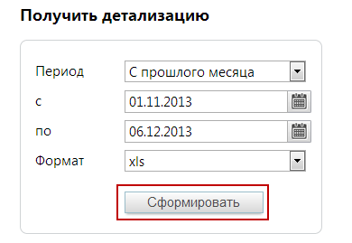

# 9.1.5. Получить детализацию совершенных разговоров

> Трассировка: PDF §9.1.5 · сквозные стр. 117-118 · источники: ч.1 `kb/sources/speech-analytics/RECHEVAYA-ANALITIKA_Skoring_Rukovodstvo-polzovatelya_v.1.26.15.pdf` с.117-118.

разговоров Список «Период» позволяет установить вариант выбора дат (по умолчанию предлагается период «Произвольный»), нажав значок календаря, или ввести их в формате дд.мм.гггг в соответствующие поля. В списке «Формат» задайте нужный (по умолчанию выбран PDF, доступны также XLS, XLSX и TXT). Нажмите кнопку «Сформировать», и появится стандартное диалоговое окно браузера, позволяющее открыть или сохранить файл. Речевая аналитика. Скоринг | v.1.26.15 117

| 8 800 555 55 22, mango-office.ru |  |
| --- | --- |
|  | mango@mangotele.com |

Внимание Первого числа любого месяца (с 00:00 до 00:00 следующего дня) получение детализации недоступно по причине формирования инвойсов за предыдущий отчетный период.
