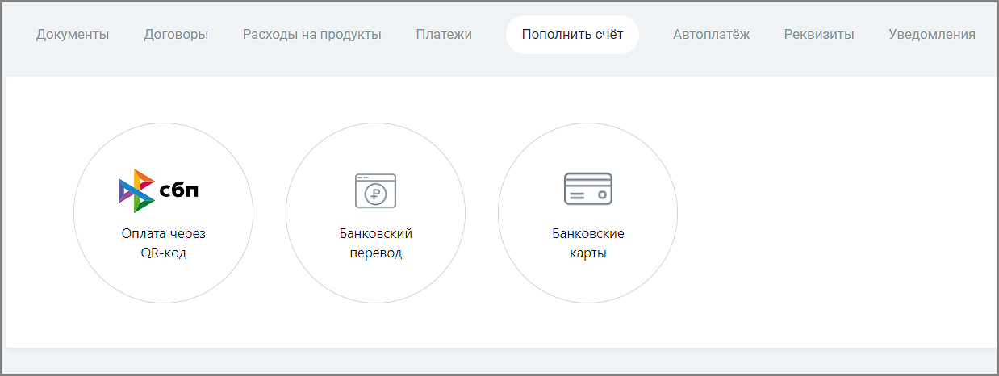

# 8.5. Пополнить счет

> Трассировка: PDF §8.5 · сквозные стр. 124-125 · источники: ч.1 `kb/sources/speech-analytics/RECHEVAYA-ANALITIKA_Skoring_Rukovodstvo-polzovatelya_v.1.26.15.pdf` с.124-125.

На вкладке Пополнить счет пополнять счет можно разными способами. Выберите наиболее удобный для вас.

Речевая аналитика. Скоринг | v.1.26.15 124

| 8 800 555 55 22, mango-office.ru |  |
| --- | --- |
|  | mango@mangotele.com |

Для того, чтобы вам было легче ориентироваться в своих расходах, на каждой странице с выбранным способом оплаты размещен информационный блок «Сколько положить на счет?». Он содержит информацию о расходах за последние 7 и 30 календарных дней соответственно. Для новых клиентов блок "Сколько положить на счет" отображается только на 9-ый день использования продукта. Начиная с 32-го дня выводятся две строки о расходах.
