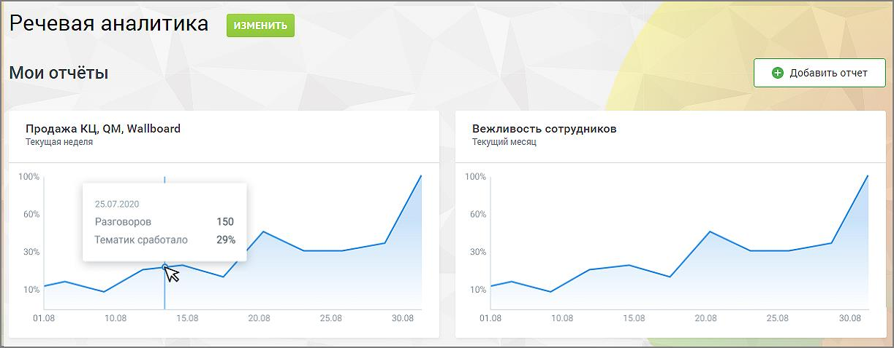

# 9. Отчеты

> Трассировка: PDF §9 · сквозные стр. 77 · источники: ч.1 `kb/sources/speech-analytics/RECHEVAYA-ANALITIKA_VATS-_-Skoring-1.26.18.pdf` с.77.

Вкладка Отчеты содержит детальную аналитическую информацию о распознанных вызовах в соответствии с заданными параметрами фильтрации. В подразделе Мои отчеты размещаются виджеты отчетов (не более 10-ти) с настроенными параметрами фильтрации, для быстрого перехода. Чтобы добавить новый виджет, нажмите кнопку «Добавить отчет», установите фильтры отчета.

При клике на кнопку сохранения отображается список доступных вариантов сохранения – таблица, график, таблица и график. Сохранение виджета выполняется только после выбора одного из вариантов. Содержание таблицы, сохраняемой на дашборде отчетов, зависит от положения чекбокса «Показать группы» в блоке «Разговоры, детализация». Примечание: Для ускорения работы с большими списками сотрудников (1500+ записей) используется виртуализация: загружаются только видимые записи. В списках до 100 записей данные отображаются полностью. Также доступны отчеты: Расходы Речевой аналитики Анализ сотрудников Анализ разговоров Анализ по чек-листам Ловец инсайтов
