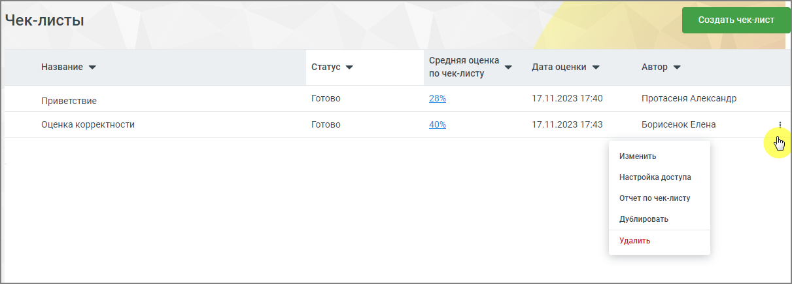
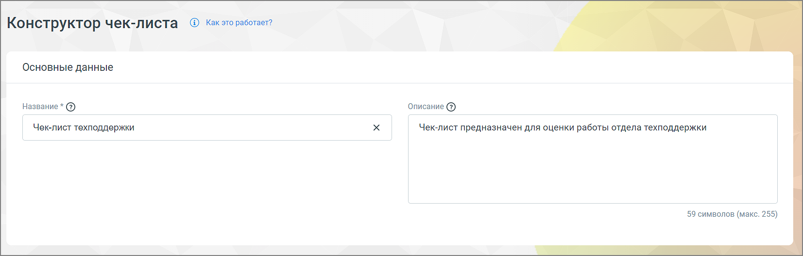

# 9.4. Анализ по чек-листам

> Трассировка: PDF §9.4 · сквозные стр. 94-96 · источники: ч.1 `kb/sources/speech-analytics/RECHEVAYA-ANALITIKA_VATS-_-Skoring-1.26.18.pdf` с.94-96.

Отчет предназначен для автоматической оценки разговора сотрудника с клиентом на соответствие стандартам компании. Клик по строке меню «Анализ по чек-листам» открывает перечень всех созданных пользователем чек-листов для оценки разговоров операторов. В окне списка доступен просмотр средней оценки по созданным чек-листам и создание нового чек-листа в Конструкторе. Речевая аналитика. ВАТС & Офлайн скоринг | v.1.26.18 94

| 8 800 555 55 22, mango-office.ru |  |
| --- | --- |
|  | mango@mangotele.com |

Заголовки столбцов (доступна сортировка): Название – задается автором на странице Конструктора Средняя оценка по чек-листу – отображается если чек-лист был просчитан. Может отображаться как цифрами, так и в процентах. Если чек лист не был просчитан – ставится прочерк Дата оценки – дата и время, когда была выставлена оценка (задается автоматически). Если чек- лист не был просчитан – ставится прочерк Автор – автор чек-листа. Изменение чек-листа доступно только автору и тем сотрудникам, которым предоставлен доступ к чек-листу. Статус – чек-лист может находиться в одном из следующих статусов, задаваемых автоматически: • Черновик – анализ по чек-листу не проводился, статистики нет; • В процессе – чек-лист находится на этапе просчета; • Ошибка просчета – любая из ошибок. При появлении ошибки рекомендуется запустить оценку по чек-листу повторно; • Готово – чек-лист оценен и есть цифровое значение. Ячейка с цифровыми данными является кнопкой, которая переводит на страницу Статистики.

Речевая аналитика. ВАТС & Офлайн скоринг | v.1.26.18 95

| 8 800 555 55 22, mango-office.ru |  |
| --- | --- |
|  | mango@mangotele.com |

Пиктограмма доступна только авторам чек-листа и сотрудникам, которым автор предоставил

доступ к чек-листу. Клик по пиктограмме в строке выделенного чек-листа открывает выпадающее меню: • Удалить – после подтверждения согласия на удаление чек-лист удаляется; • Дублировать – создание дубля чек-листа, в котором все поля кроме Названия и Описания заполнены так же, как и в оригинале. Если в списке уже создано 10 чек-листов кнопка не работает; • Отчет по чек-листу – переход на страницу Статистики по данному чек-листу; • Настройка доступа – при нажатии на строку открывается окно, в котором автор может выбрать сотрудников, получающих доступ к чек-листу. Список доступных сотрудников не ограничивается подконтрольными группами — доступны все пользователи, имеющие права доступа к Речевой аналитике. • Изменить – переход на страницу Конструктора, с возможностью редактировать чек-лист.
