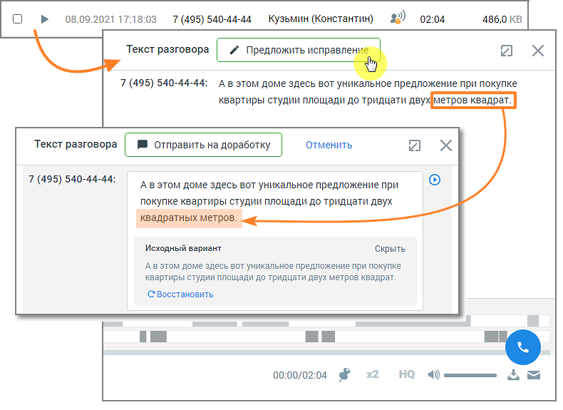
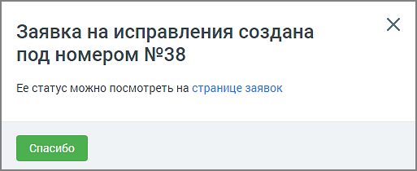
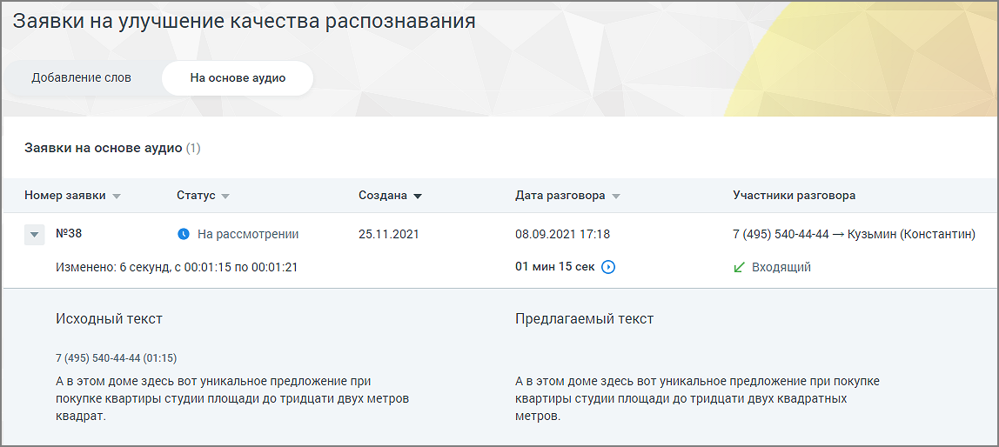

# 6.6. Заявки на улучшение качества распознавания

> Трассировка: PDF §6.6 · сквозные стр. 54-57 · источники: ч.1 `kb/sources/speech-analytics/RECHEVAYA-ANALITIKA_1.26.18.pdf` с.54-57.

распознавания Пользователь, который выбрал для распознавания технологию 3iTech, может отправить заявку на улучшение качества распознавания и отслеживать статус заявки в ЛК ВАТС. внимание Для доступа пользователя к разделу необходимо наличие права «Просматривать и создавать/изменять тематики» Добавление слов Чтобы отправить заявку на добавление слова, которое не знакомо «Речевой аналитике», следует в разделе «Тематики» выбрать тематику, в которой имеются незнакомые слова, и открыть карточку тематики.

Внизу карточки тематики будет присутствовать уведомление о незнакомом слове и предложение добавить его в систему. Нажмите кнопку Добавить. Заявка отобразится в окне раздела «Заявки на улучшение качества распознавания», на вкладке «Добавление слов». Речевая аналитика | v.1.26.18 54

| 8 800 555 55 22, mango-office.ru |  |
| --- | --- |
|  | mango@mangotele.com |

Окно заявки содержит следующие данные: • Номер заявки • Статус заявки – на рассмотрении, исправления приняты, исправления отклонены. • Дата создания заявки • Дата, до которой будет рассмотрена заявка Также в окне можно ознакомиться с предлагаемым для анализа словом. Речевая аналитика | v.1.26.18 55

| 8 800 555 55 22, mango-office.ru |  |
| --- | --- |
|  | mango@mangotele.com |

На основе аудио Чтобы отправить заявку на основе аудиозаписи, в окне расшифровки записи разговора следует нажать кнопку Предложить исправления.

Далее внесите в текст требуемое исправление и нажмите кнопку Отправить на доработку. На экране отобразится окно системного уведомления:

Клик по ссылке открывает окно раздела «Заявки на улучшение качества распознавания», на вкладке «На основе аудио». Речевая аналитика | v.1.26.18 56

| 8 800 555 55 22, mango-office.ru |  |
| --- | --- |
|  | mango@mangotele.com |

Окно заявки содержит следующие данные: • Номер заявки • Статус заявки – на рассмотрении, исправления приняты, исправления отклонены. • Дата создания заявки • Дата разговора и его длительность • Участники разговора и информация о звонке (входящий или исходящий) Также в окне можно ознакомиться с исходным и предлагаемым к замене текстом. О времени выполнения заявки пользователь уведомляется системным сообщением.
