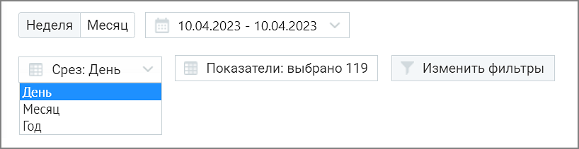
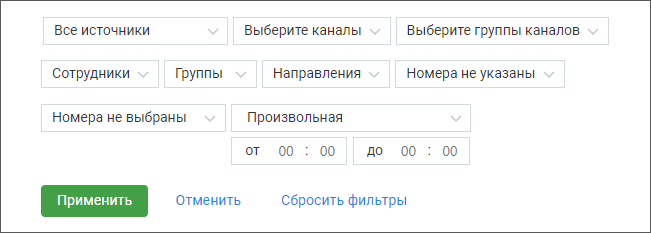
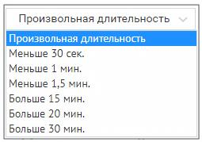
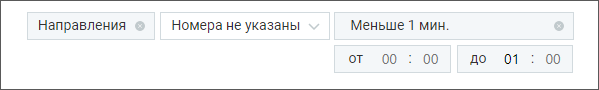
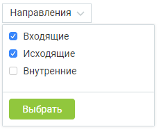

# 8.3.1. Блок фильтров

> Трассировка: PDF §8.3.1 · сквозные стр. 76-78 · источники: ч.1 `kb/sources/speech-analytics/RECHEVAYA-ANALITIKA_1.26.18.pdf` с.76-78.

Для построения отчета “Анализ разговоров” выберите временной период, срез (день/месяц/год) и показатели, по которым будет формироваться отчет.

О показателях, по которым осуществляется формирование отчета, подробнее здесь.

| Если нажать кнопку «Отмена» или пиктограмму , изменения не будут внесены, а выборка |
| --- |
| показателей вернется к последней сохраненной версии. |

По завершению работы указанных выше фильтров отчет будет сформирован автоматически. Для дополнительной фильтрации данных в отчете откройте выпадающий список Изменить фильтры. Откроются поля дополнительных фильтров.

Источник записи – выбор типа записи разговора: телефонные разговоры/ текстовые коммуникации. Каналы коммуникации – выбор из выпадающего списка доступных в разделе «Диалоги» ЛК ВАТС каналов коммуникации. Варианты: Чат на сайте, ВКонтакте, Viber, Telegram, WhatsApp, Avito. При выборе типа записи разговора «телефонные разговоры» фильтр недоступен. Группы каналов – выбор из выпадающего списка созданных в разделе «Диалоги» ЛК ВАТС групп каналов коммуникации. При выборе типа записи разговора «телефонные разговоры» фильтр недоступен. Каналы коммуникации будут отображаться только в том случае, если соответствующая услуга была ранее подключена. Сотрудники – список всех сотрудников, сгруппированный по группам. При выборе типа записи разговора «текстовые коммуникации» в списке доступны только выбранные в разделе Настройки/Аналитика текстовых коммуникаций сотрудники. Если ни один сотрудник не выбран, отчет формируется по всем сотрудникам. Речевая аналитика | v.1.26.18 76

| 8 800 555 55 22, mango-office.ru |  |
| --- | --- |
|  | mango@mangotele.com |

Группы – при установке флага напротив наименования группы сформированный отчет будет включать только выбранные группы. Для быстрого выбора всех групп предусмотрен общий флаг. Направление – входящий, исходящий, внутренний звонок или текстовое сообщение. Номера клиента – фильтрация только по любым добавленным номерам. При выборе типа записи разговора «текстовые коммуникации» фильтр недоступен. Номер ВАТС – фильтрация только выбранным номерам ВАТС. При выборе типа записи разговора «текстовые коммуникации» или «офлайн-записи» фильтр недоступен. Длительность – продолжительность разговора. По умолчанию установлен параметр «произвольная длительность». При выборе типа записи разговора «текстовые коммуникации» фильтр недоступен.

Внутри фильтра действует принцип фильтрации – ИЛИ (когда одно из условий истинно). Между фильтрами действует принцип фильтрации – И (когда все условия истинны). ПРИМЕР 1

В фильтре Направление (внутри фильтра) выбраны: Входящие, Исходящие. При поиске по заданным условиям в отчете будут представлены вызовы, когда хотя бы одно из условий истинно – т. е. или входящие, или исходящие вызовы или текстовые сообщения. ПРИМЕР 2 В фильтре Направление выбраны: Входящие. В фильтре Длительность выбрано «Меньше 1 мин.». При поиске по заданным условиям в отчете будут представлены вызовы, когда оба условия истинны – т. е. входящие вызовы длительностью менее 1 минуты.

Кнопкой «Выбрать» сохраните внесенные изменения. Речевая аналитика | v.1.26.18 77

| 8 800 555 55 22, mango-office.ru |  |
| --- | --- |
|  | mango@mangotele.com |
