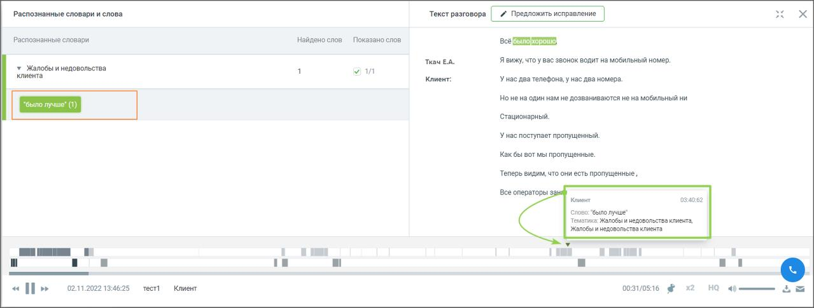

# 8.3.4. Детализация

> Трассировка: PDF §8.3.4 · сквозные стр. 80-81 · источники: ч.1 `kb/sources/speech-analytics/RECHEVAYA-ANALITIKA_1.26.18.pdf` с.80-81.

По клику на цифру "Количество распознанных разговоров" открывается окно детализации разговоров - телефонных разговоров и текстовых коммуникаций - за выбранный период времени. Также можно просмотреть записи разговоров и тексты сообщений по конкретным тематикам. Для этого необходимо включить отображение данных по тематикам, как числовое. Окно детализации разговоров содержит следующие данные о разговорах: • Дату и время разговора • Кто инициатор разговора • С кем говорил Речевая аналитика | v.1.26.18 80

| 8 800 555 55 22, mango-office.ru |  |
| --- | --- |
|  | mango@mangotele.com |

• Длительность разговора • Список тематик, которые присвоены разговору • Длительность обоюдного молчания • Доля разговора/обоюдного молчания • Количество перебиваний сотрудником/клиентом • Доля обоюдного разговора/сотрудника/клиента • Скорость разговора сотрудника/клиента Если какие-то из показателей разговора не доступны для данного типа записи разговора или не выбраны в фильтрах, то в окне детализации они также не отражаются. В окне детализации разговоров пользователю доступны следующие действия: поиск по записям, прослушивание, просмотр расшифровки разговора (при наличии), просмотр текстовых сообщений, скачивание текстовых сообщений, аудиозаписи и расшифровки разговора. Клик на строку разговора открывает окно со следующей информацией: • Тематики и ключевые слова – список распознанных ключевых слов, сгруппированный по тематикам. • Расшифровка текста разговора – помимо текста разговора включает данные сотрудника и клиента, а также метки вхождений. Для внутренних разговоров – данные обоих сотрудников. • Окно с текстом разговора и плеером с отметками фрагментов разговора и вхождений

терм . Вид окна зависит от типа разговора (телефонный разговор или текстовые коммуникации).

Рис.1. Окно с текстовой расшифровкой звонка и плеером Экспорт данных Предусмотрен экспорт файла отчета «Тематики по словам» в формате XLS. После клика на кнопку XLS будет открыто стандартное диалоговое окно браузера, позволяющее сохранить файл.
