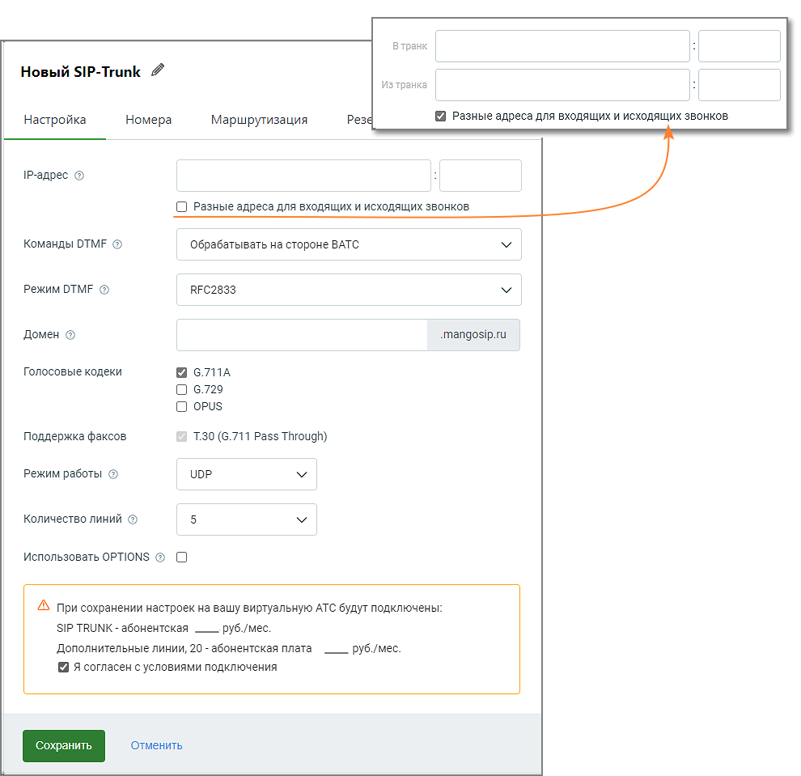

# Вкладка Настройка

> Трассировка: PDF §10.4 · сквозные стр. 121-123 · источники: ч.1 `kb/sources/speech-analytics/RECHEVAYA-ANALITIKA_1.26.18.pdf` с.121-123.

В открывшейся вкладке Настройка заполните поля: IP-адрес и порт - укажите в них IP-адрес и порт вашей кАТС (они должны быть известны системному администратору вашей компании). Поле обязательно для заполнения. Допускается ввод нескольких портов, с использованием: • числа – для указания порта; • знаков "," (запятая) и ";" (точка с запятой) – для перечисления портов; • знаков "-" (тире или дефис) – для указания диапазона портов; • знака " " (пробел). Разные адреса для входящих и исходящих звонков – если чекбокс проставлен, открывается дополнительное поле для ввода IP-адреса и порта. Таким образом разделяется IP клиентской АТС: отдельно для входящих звонков из ВАТС в клиентскую АТС и исходящих звонков из клиентской АТС в ВАТС. Команды DTMF - обрабатывать или не обрабатывать DTMF-команды на стороне ВАТС. Речевая аналитика | v.1.26.18 121

| 8 800 555 55 22, mango-office.ru |  |
| --- | --- |
|  | mango@mangotele.com |

Если включено, ВАТС будет пытаться выполнить известные ей команды (например, удержание или перевод вызова). В таком случае рекомендуем отключить обработку DTMF на стороне кАТС во избежание возможной двойной реакции на некоторые команды (одновременно со стороны ВАТС и кАТС). Если выключено, ВАТС будет просто передавать все DTMF-сигналы в кАТС, в таком случае обработка команд должна быть настроена на стороне кАТС. Режим DTMF - • RFC2833 - в этом случае известные DTMF-команды передаются в формате RFC2833, передача идет отдельно от голосового канала; • INBAND - в этом случае известные DTMF-команды передаются в формате Inband, с передачей в голосовом канале; Домен - домен для удобства адресации звонков. Вместо того чтобы вводить IP SIP-шлюза MANGO OFFICE, вы можете создать домен и прописать в настройках клиентской АТС именно домен. Поле необязательно для заполнения. Если вы не создали домен, то при настройке вашей кАТС используйте следующие данные SIP- шлюза MANGO OFFICE: host = 81.88.86.55 port = 5060 Адрес может измениться. За информацией по новым параметром обратитесь к сотруднику техподдержки MANGO OFFICE, заполнив форму в Личном кабинете.

| СОВЕТ: Для более стабильной работы сип-транка во время тестового периода, в настройках |
| --- |
| кАТС рекомендуется указывать именно IP-адрес и порт, а не создавать домен. |

Голосовые кодеки - для звонков, проходящих через транк, используются выбранные для данного транка кодеки (алгоритмы сжатия голоса). Если ваша кАТС не поддерживает какие-то из них, отключите их. В общем случае рекомендуется использовать тот же кодек, который используется в вашей кАТС как основной. Поддержка факсов - поддержка факсов возможна только по одному протоколу и активна всегда; Режим работы - выбор между UDP и TCP определяет протокол, который будет использоваться для установления связи между клиентской АТС (кАТС) и SIP-шлюзом MANGO OFFICE. Выбор между UDP и TCP зависит от требований. Если стабильность и надежность соединения важнее, то TCP может быть более подходящим выбором. Если важна низкая задержка, а некоторая потеря данных в режиме реального времени не критична, то UDP может быть предпочтительным вариантом. Важно также удостовериться, что клиентская АТС поддерживает выбранный протокол Количество линий - максимальное число одновременных звонков между ВАТС и кАТС. Сюда относятся входящие, исходящие и внутренние звонки. Допускается выбор от 5 до 100 линий; Если количество линий достигло максимального значения, при попытке дозвона пользователь получит сообщение “Линия занята”; Использовать OPTIONS - если чек-бокс включен, то SIP-шлюз MANGO OFFICE будет проверять доступность клиентской АТС посредством посылки пакетов OPTIONS. • Если кАТС в ответ на запросы OPTIONS возвращает код ответа сервера «200 OK», она считается доступной. • Если кАТС в ответ на запросы OPTIONS возвращает иной код ответа сервера, она считается недоступной, о чем появляется соответствующее системное уведомление. В случае наличия разных адресов для входящих и исходящих вызовов статус подключения и полученные ошибки будут отображаться только для транка, указанного в параметре «В транк». Речевая аналитика | v.1.26.18 122

| 8 800 555 55 22, mango-office.ru |  |
| --- | --- |
|  | mango@mangotele.com |
