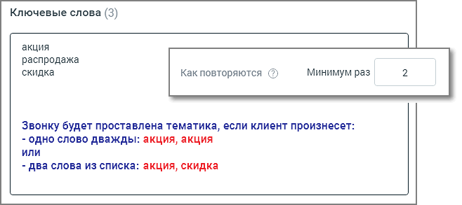
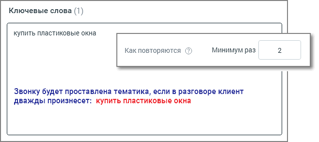

# 6.2.2. Расширенные настройки

> Трассировка: PDF §6.2.2 · сквозные стр. 46-47 · источники: ч.1 `kb/sources/speech-analytics/RECHEVAYA-ANALITIKA_1.26.18.pdf` с.46-47.

Блок добавления условий содержит следующие поля: Кого анализируем – выбор канала для анализа. Если выбран канал «сотрудник», поиск вхождений ведется в том числе и по внутренним разговорам. Если выбран канал «клиент», поиск вхождений по внутренним разговорам не ведется. Где встречаются. Укажите в каком месте разговора искать слова/термы (выберите из выпадающего списка): • Во всем разговоре; • В начале разговора: первые 20% длительности разговора; • В середине разговора: отрезок между началом и концом разговора; • В конце разговора: последние 20% длительности разговора; Для второго и третьего условия выпадающий список Где встречаются содержит дополнительные элементы: • В следующей фразе: только в следующем фрагменте разговора после срабатывания предыдущего условия; • В следующих фразах: во всех следующих фрагментах разговора после срабатывания предыдущего условия; Как повторяются. Задайте минимальное количество вхождений, необходимое для срабатывания условия. Допускается ввод целого положительного числа, содержащего не более 3 цифр. Данное поле является обязательным для заполнения. Выбор числа, превышающего единицу, исключает возможность единичной ошибки распознавания термы при присвоении звонку тематики. Речевая аналитика | v.1.26.18 46

| 8 800 555 55 22, mango-office.ru |  |
| --- | --- |
|  | mango@mangotele.com |

Эта функция требует осознанного подхода к использованию, так как при этом некоторые целевые звонки могут быть исключены из поиска.

Какие слова ищем. Выпадающий список Говорил/Не говорил задает поиск по наличию либо отсутствию терм в распознанных записях разговоров. Добавить дополнительные условия для данной тематики можно, щелкнув по кнопке Добавить условие. Для одной тематики можно добавить не более трех блоков условий. Модуль Речевая аналитика проверяет разговор на соответствие каждому из условий, в порядке их следования. Только если срабатывают все заданные условия, разговору присваивается тематика.
